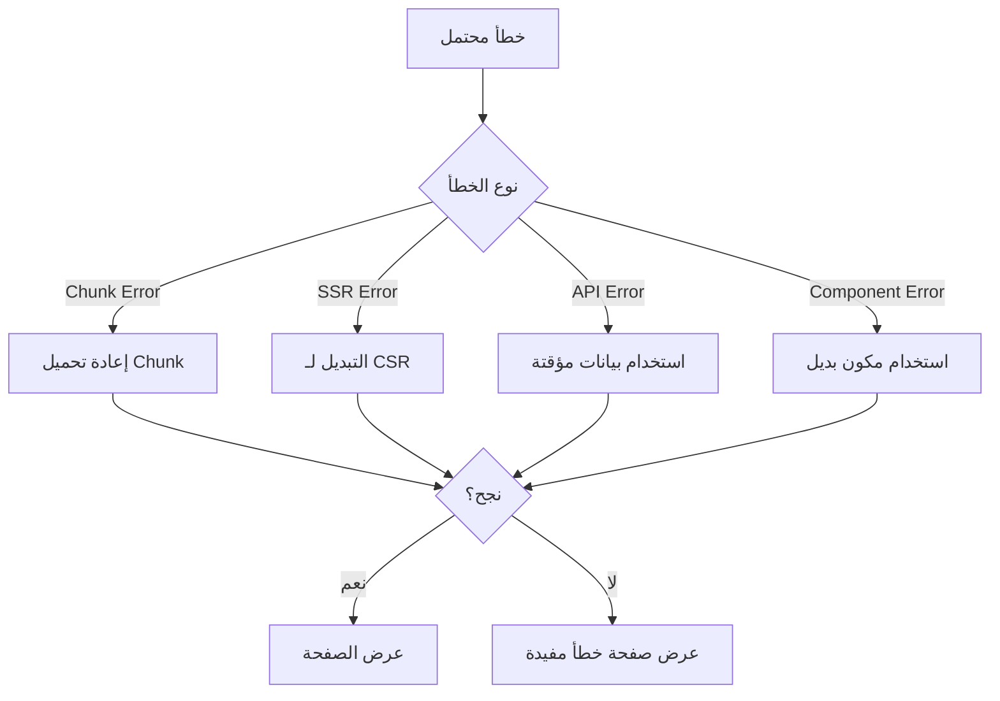

# تصميم حل مشكلة الصفحة البيضاء

## نظرة عامة

بناءً على فحص الكود، تم تحديد عدة أسباب محتملة للصفحة البيضاء:

1. **أخطاء في تحميل JavaScript chunks**
2. **مشاكل في Server-Side Rendering (SSR)**
3. **أخطاء في استيراد المكونات**
4. **فشل في جلب البيانات من API**
5. **مشاكل في Error Boundaries**

## الهيكل المعماري

### 1. نظام تشخيص الأخطاء المتقدم

```typescript
interface ErrorDiagnostics {
  errorType: 'chunk' | 'ssr' | 'api' | 'component' | 'network';
  errorMessage: string;
  stackTrace: string;
  userAgent: string;
  timestamp: number;
  pageUrl: string;
  userId?: string;
}
```

#### مكونات النظام:
- **ErrorDetector**: يكتشف نوع الخطأ تلقائياً
- **ErrorLogger**: يسجل الأخطاء محلياً وعلى الخادم
- **ErrorReporter**: يرسل تقارير للمطورين
- **RecoveryManager**: يحاول الاسترداد التلقائي

### 2. نظام الاسترداد التدريجي



### 3. مكونات الحل

#### أ) Enhanced Error Boundary
```typescript
class SmartErrorBoundary extends Component {
  // تشخيص ذكي للأخطاء
  // استرداد تلقائي
  // واجهة مستخدم محسنة
  // تسجيل مفصل
}
```

#### ب) Chunk Loading Manager
```typescript
class ChunkLoadingManager {
  // إعادة المحاولة التلقائية
  // تنظيف الكاش
  // تحميل بديل
  // مراقبة الأداء
}
```

#### ج) SSR Fallback System
```typescript
class SSRFallbackSystem {
  // كشف مشاكل SSR
  // التبديل لـ CSR
  // حفظ حالة المستخدم
  // تحسين الأداء
}
```

#### د) API Error Handler
```typescript
class APIErrorHandler {
  // إعادة المحاولة الذكية
  // استخدام بيانات مؤقتة
  // وضع عدم الاتصال
  // تنبيهات المستخدم
}
```

## واجهات المستخدم

### 1. صفحة خطأ تفاعلية

```typescript
interface ErrorPageProps {
  errorType: string;
  errorMessage: string;
  recoveryOptions: RecoveryOption[];
  userFriendlyMessage: string;
}
```

**الميزات:**
- رسائل واضحة بالعربية
- خيارات إصلاح متعددة
- معلومات مفيدة للمستخدم
- تصميم جذاب وهادئ

### 2. مؤشرات التحميل الذكية

```typescript
interface SmartLoadingProps {
  loadingState: 'initial' | 'retrying' | 'fallback' | 'error';
  progress?: number;
  message?: string;
  estimatedTime?: number;
}
```

### 3. نظام الإشعارات

```typescript
interface NotificationSystem {
  showError(message: string, options?: NotificationOptions): void;
  showRecovery(message: string, actions: Action[]): void;
  showProgress(message: string, progress: number): void;
}
```

## استراتيجية معالجة الأخطاء

### 1. Chunk Loading Errors
```typescript
// إعادة المحاولة مع تأخير تدريجي
// تنظيف service workers
// تحميل من CDN بديل
// عرض محتوى مؤقت
```

### 2. SSR Hydration Errors
```typescript
// كشف عدم تطابق SSR/CSR
// إعادة التحميل من جانب العميل
// حفظ حالة النموذج
// تحسين الأداء
```

### 3. API Failures
```typescript
// إعادة المحاولة مع backoff
// استخدام بيانات مخزنة مؤقتاً
// وضع عدم الاتصال
// تنبيه المستخدم
```

### 4. Component Errors
```typescript
// استخدام مكونات بديلة
// عزل الأخطاء
// حفظ حالة المستخدم
// تسجيل مفصل
```

## خطة التنفيذ

### المرحلة 1: التشخيص والمراقبة
1. إنشاء نظام تشخيص شامل
2. إضافة مراقبة في الوقت الفعلي
3. تحسين تسجيل الأخطاء
4. إنشاء لوحة مراقبة للمطورين

### المرحلة 2: الاسترداد التلقائي
1. تطوير آليات الاسترداد
2. تحسين Error Boundaries
3. إضافة نظام إعادة المحاولة
4. تنفيذ التحميل البديل

### المرحلة 3: تحسين تجربة المستخدم
1. تصميم واجهات خطأ جذابة
2. إضافة رسائل مفيدة
3. تحسين مؤشرات التحميل
4. تنفيذ نظام الإشعارات

### المرحلة 4: الاختبار والتحسين
1. اختبار جميع سيناريوهات الأخطاء
2. تحسين الأداء
3. مراجعة تجربة المستخدم
4. توثيق الحلول

## مقاييس النجاح

1. **تقليل معدل الصفحات البيضاء بنسبة 95%**
2. **تحسين وقت الاسترداد إلى أقل من 3 ثوانٍ**
3. **زيادة رضا المستخدمين عن معالجة الأخطاء**
4. **تقليل تقارير الأخطاء من المستخدمين بنسبة 80%**

## الاعتبارات التقنية

### الأداء
- تحميل كود الأخطاء بشكل منفصل
- تحسين حجم الحزم
- استخدام lazy loading للمكونات الثقيلة

### الأمان
- عدم كشف معلومات حساسة في رسائل الخطأ
- تشفير تقارير الأخطاء
- التحقق من صحة البيانات

### إمكانية الوصول
- دعم قارئات الشاشة
- تباين ألوان مناسب
- دعم التنقل بلوحة المفاتيح

### التوافق
- دعم جميع المتصفحات الحديثة
- تحسين للأجهزة المحمولة
- دعم الاتصال البطيء