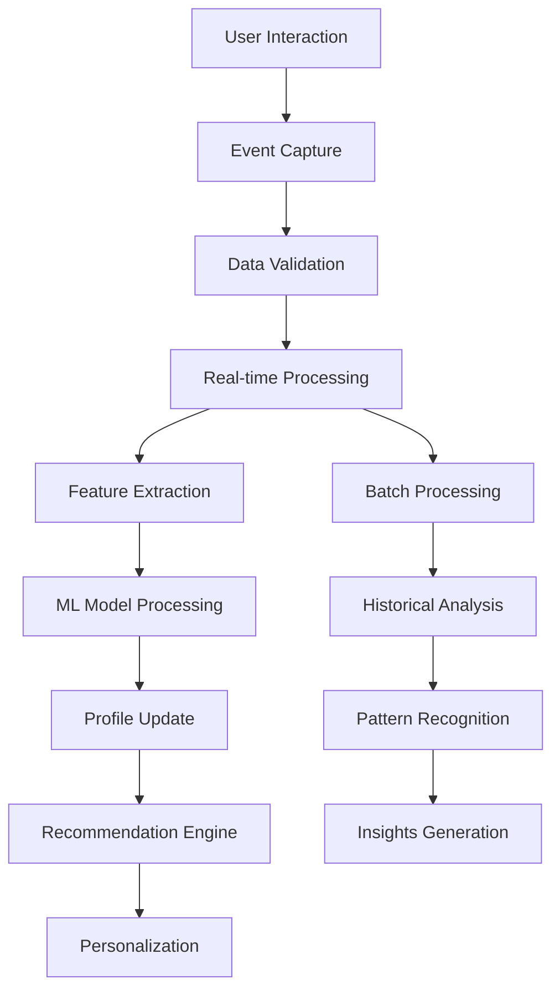

# 📊 نظام تحليل السلوك والاهتمامات - سبق الذكية

## 📋 جدول المحتويات
1. [نظرة عامة](#نظرة-عامة)
2. [تتبع السلوك](#تتبع-السلوك)
3. [تحليل الاهتمامات](#تحليل-الاهتمامات)
4. [تتبع القراءة](#تتبع-القراءة)
5. [نظام نقاط الولاء](#نظام-نقاط-الولاء)
6. [تحليل المشاعر](#تحليل-المشاعر)
7. [التقنيات المستخدمة](#التقنيات-المستخدمة)
8. [آلية العمل](#آلية-العمل)
9. [قاعدة البيانات](#قاعدة-البيانات)
10. [الخوارزميات والنماذج](#الخوارزميات-والنماذج)

---

## 🎯 نظرة عامة

نظام تحليل السلوك والاهتمامات في "سبق الذكية" هو نظام متطور يستخدم الذكاء الاصطناعي وتحليل البيانات الضخمة لفهم سلوك المستخدمين وتفضيلاتهم، وتقديم تجربة مخصصة وذكية.

### الأهداف الرئيسية:
- 🔍 **تتبع شامل للسلوك**: مراقبة كل تفاعل للمستخدم
- 🧠 **فهم الاهتمامات**: تحليل عميق للتفضيلات الشخصية
- 📚 **تحليل أنماط القراءة**: فهم كيفية استهلاك المحتوى
- 🏆 **نظام مكافآت ذكي**: تحفيز المشاركة والولاء
- 💭 **تحليل المشاعر**: فهم ردود الأفعال العاطفية
- 🎯 **تخصيص المحتوى**: توصيات دقيقة ومخصصة

---

## 👤 تتبع السلوك

### **1. أنواع السلوك المتتبعة**

#### **أ. سلوك التصفح**
```typescript
interface BrowsingBehavior {
  sessionId: string;
  userId?: string;
  pageViews: PageView[];
  navigationPath: NavigationEvent[];
  timeOnSite: number;
  bounceRate: boolean;
  deviceInfo: DeviceInfo;
  locationData?: LocationData;
}

interface PageView {
  url: string;
  title: string;
  category: string;
  timestamp: Date;
  timeSpent: number;
  scrollDepth: number;
  exitPoint?: string;
  referrer?: string;
}
```

#### **ب. سلوك القراءة**
```typescript
interface ReadingBehavior {
  articleId: string;
  userId: string;
  startTime: Date;
  endTime: Date;
  readingSpeed: number; // كلمة في الدقيقة
  completionRate: number; // نسبة الإكمال
  scrollPattern: ScrollEvent[];
  pausePoints: PausePoint[];
  rehighlights: RehighlightEvent[];
  bookmarked: boolean;
  shared: boolean;
}

interface ScrollEvent {
  timestamp: Date;
  position: number;
  direction: 'up' | 'down';
  speed: number;
}
```

#### **ج. سلوك التفاعل**
```typescript
interface InteractionBehavior {
  userId: string;
  interactionType: InteractionType;
  targetId: string;
  timestamp: Date;
  context: InteractionContext;
  sentiment?: SentimentScore;
}

enum InteractionType {
  LIKE = 'like',
  COMMENT = 'comment',
  SHARE = 'share',
  BOOKMARK = 'bookmark',
  FOLLOW = 'follow',
  SEARCH = 'search',
  CLICK = 'click',
  HOVER = 'hover'
}
```

### **2. تقنيات التتبع**

#### **Client-Side Tracking**
```typescript
class BehaviorTracker {
  private analytics: AnalyticsEngine;
  private sessionId: string;
  private userId?: string;
  
  constructor() {
    this.analytics = new AnalyticsEngine();
    this.sessionId = this.generateSessionId();
    this.setupEventListeners();
  }
  
  private setupEventListeners(): void {
    // تتبع النقرات
    document.addEventListener('click', (event) => {
      this.trackClick(event);
    });
    
    // تتبع التمرير
    window.addEventListener('scroll', throttle(() => {
      this.trackScroll();
    }, 100));
    
    // تتبع وقت البقاء
    window.addEventListener('beforeunload', () => {
      this.trackSessionEnd();
    });
    
    // تتبع تغيير الصفحة
    window.addEventListener('popstate', () => {
      this.trackPageChange();
    });
  }
  
  trackClick(event: MouseEvent): void {
    const target = event.target as HTMLElement;
    const clickData = {
      elementType: target.tagName,
      elementId: target.id,
      elementClass: target.className,
      text: target.textContent?.substring(0, 100),
      coordinates: { x: event.clientX, y: event.clientY },
      timestamp: new Date(),
      url: window.location.href
    };
    
    this.analytics.track('click', clickData);
  }
  
  trackScroll(): void {
    const scrollData = {
      scrollTop: window.pageYOffset,
      scrollHeight: document.documentElement.scrollHeight,
      clientHeight: window.innerHeight,
      scrollPercentage: (window.pageYOffset / 
        (document.documentElement.scrollHeight - window.innerHeight)) * 100,
      timestamp: new Date()
    };
    
    this.analytics.track('scroll', scrollData);
  }
}
```

#### **Server-Side Processing**
```python
# معالجة البيانات على الخادم
class BehaviorProcessor:
    def __init__(self):
        self.db = DatabaseConnection()
        self.ml_models = MLModelManager()
        self.cache = RedisCache()
    
    async def process_behavior_event(self, event_data: dict):
        """معالجة حدث سلوك المستخدم"""
        try:
            # تنظيف وتحليل البيانات
            cleaned_data = self.clean_event_data(event_data)
            
            # استخراج الميزات
            features = self.extract_features(cleaned_data)
            
            # تحديث ملف المستخدم
            await self.update_user_profile(cleaned_data['user_id'], features)
            
            # تحليل الأنماط في الوقت الفعلي
            patterns = await self.analyze_real_time_patterns(cleaned_data)
            
            # تحديث نماذج التعلم الآلي
            await self.update_ml_models(features, patterns)
            
            # إرسال تحديثات للأنظمة الأخرى
            await self.notify_other_systems(cleaned_data, patterns)
            
        except Exception as e:
            logger.error(f"خطأ في معالجة السلوك: {e}")
    
    def extract_features(self, event_data: dict) -> dict:
        """استخراج الميزات من بيانات السلوك"""
        features = {}
        
        # ميزات زمنية
        features['hour_of_day'] = event_data['timestamp'].hour
        features['day_of_week'] = event_data['timestamp'].weekday()
        features['is_weekend'] = event_data['timestamp'].weekday() >= 5
        
        # ميزات الجهاز
        features['device_type'] = event_data.get('device_info', {}).get('type')
        features['browser'] = event_data.get('device_info', {}).get('browser')
        features['screen_size'] = event_data.get('device_info', {}).get('screen_size')
        
        # ميزات المحتوى
        if 'article_id' in event_data:
            article = self.get_article_metadata(event_data['article_id'])
            features['content_category'] = article.get('category')
            features['content_length'] = article.get('word_count')
            features['content_sentiment'] = article.get('sentiment_score')
        
        return features
```

---

## 🎯 تحليل الاهتمامات

### **1. خوارزمية تحليل الاهتمامات**

```python
import numpy as np
from sklearn.feature_extraction.text import TfidfVectorizer
from sklearn.cluster import KMeans
from sklearn.decomposition import LatentDirichletAllocation

class InterestAnalyzer:
    def __init__(self):
        self.vectorizer = TfidfVectorizer(
            max_features=1000,
            stop_words=self.get_arabic_stopwords(),
            ngram_range=(1, 3)
        )
        self.topic_model = LatentDirichletAllocation(n_components=20)
        self.interest_categories = self.load_interest_categories()
    
    def analyze_user_interests(self, user_id: str) -> dict:
        """تحليل اهتمامات المستخدم"""
        
        # جمع بيانات المستخدم
        user_data = self.get_user_reading_history(user_id)
        
        # تحليل المحتوى المقروء
        content_interests = self.analyze_content_interests(user_data['articles'])
        
        # تحليل سلوك البحث
        search_interests = self.analyze_search_behavior(user_data['searches'])
        
        # تحليل التفاعلات الاجتماعية
        social_interests = self.analyze_social_interactions(user_data['interactions'])
        
        # دمج النتائج
        combined_interests = self.combine_interest_signals(
            content_interests, search_interests, social_interests
        )
        
        # تصنيف الاهتمامات
        categorized_interests = self.categorize_interests(combined_interests)
        
        return {
            'primary_interests': categorized_interests['primary'],
            'secondary_interests': categorized_interests['secondary'],
            'emerging_interests': categorized_interests['emerging'],
            'declining_interests': categorized_interests['declining'],
            'confidence_scores': categorized_interests['confidence'],
            'last_updated': datetime.now()
        }
    
    def analyze_content_interests(self, articles: List[dict]) -> dict:
        """تحليل الاهتمامات من المحتوى المقروء"""
        
        # استخراج النصوص
        texts = []
        weights = []
        
        for article in articles:
            texts.append(f"{article['title']} {article['content']}")
            # وزن أعلى للمقالات المقروءة بالكامل
            weight = article['completion_rate'] * article['time_spent'] / 100
            weights.append(weight)
        
        # تحليل TF-IDF
        tfidf_matrix = self.vectorizer.fit_transform(texts)
        
        # تطبيق الأوزان
        weighted_matrix = tfidf_matrix.multiply(np.array(weights).reshape(-1, 1))
        
        # استخراج الموضوعات
        topics = self.topic_model.fit_transform(weighted_matrix)
        
        # تحليل الكلمات المفتاحية
        feature_names = self.vectorizer.get_feature_names_out()
        topic_keywords = self.extract_topic_keywords(topics, feature_names)
        
        return {
            'topics': topic_keywords,
            'keyword_weights': self.calculate_keyword_weights(weighted_matrix),
            'category_preferences': self.analyze_category_preferences(articles)
        }
    
    def calculate_interest_evolution(self, user_id: str, time_window: int = 30) -> dict:
        """تحليل تطور الاهتمامات عبر الزمن"""
        
        # جمع البيانات التاريخية
        historical_data = self.get_historical_interests(user_id, time_window)
        
        # تحليل الاتجاهات
        trends = {}
        for interest in historical_data:
            trend_data = self.calculate_trend(interest['scores'])
            trends[interest['name']] = {
                'direction': trend_data['direction'],  # صاعد/نازل/ثابت
                'velocity': trend_data['velocity'],    # سرعة التغيير
                'stability': trend_data['stability'],  # استقرار الاهتمام
                'prediction': trend_data['prediction'] # توقع مستقبلي
            }
        
        return trends
```

### **2. تصنيف الاهتمامات**

```typescript
// تصنيف الاهتمامات حسب المجالات
interface InterestCategory {
  id: string;
  name: string;
  nameAr: string;
  keywords: string[];
  subcategories: InterestSubcategory[];
  weight: number;
}

const INTEREST_CATEGORIES: InterestCategory[] = [
  {
    id: 'politics',
    name: 'Politics',
    nameAr: 'سياسة',
    keywords: ['سياسة', 'حكومة', 'انتخابات', 'برلمان', 'وزير', 'رئيس'],
    subcategories: [
      { id: 'local_politics', nameAr: 'سياسة محلية' },
      { id: 'international_politics', nameAr: 'سياسة دولية' },
      { id: 'elections', nameAr: 'انتخابات' }
    ],
    weight: 1.0
  },
  {
    id: 'technology',
    name: 'Technology',
    nameAr: 'تقنية',
    keywords: ['تقنية', 'تكنولوجيا', 'ذكي', 'رقمي', 'إنترنت', 'تطبيق'],
    subcategories: [
      { id: 'ai', nameAr: 'ذكاء اصطناعي' },
      { id: 'mobile', nameAr: 'هواتف ذكية' },
      { id: 'software', nameAr: 'برمجيات' }
    ],
    weight: 1.2
  },
  {
    id: 'sports',
    name: 'Sports',
    nameAr: 'رياضة',
    keywords: ['رياضة', 'كرة', 'مباراة', 'بطولة', 'لاعب', 'فريق'],
    subcategories: [
      { id: 'football', nameAr: 'كرة القدم' },
      { id: 'basketball', nameAr: 'كرة السلة' },
      { id: 'olympics', nameAr: 'ألعاب أولمبية' }
    ],
    weight: 0.9
  }
];

class InterestClassifier {
  classifyUserInterests(userBehavior: UserBehavior): ClassifiedInterests {
    const interests: ClassifiedInterests = {
      primary: [],
      secondary: [],
      emerging: [],
      scores: {}
    };
    
    // تحليل كل فئة
    for (const category of INTEREST_CATEGORIES) {
      const score = this.calculateCategoryScore(userBehavior, category);
      interests.scores[category.id] = score;
      
      // تصنيف حسب النتيجة
      if (score > 0.7) {
        interests.primary.push(category);
      } else if (score > 0.4) {
        interests.secondary.push(category);
      } else if (score > 0.2 && this.isEmergingInterest(userBehavior, category)) {
        interests.emerging.push(category);
      }
    }
    
    return interests;
  }
  
  private calculateCategoryScore(behavior: UserBehavior, category: InterestCategory): number {
    let score = 0;
    
    // تحليل المقالات المقروءة
    const articleScore = this.analyzeArticleRelevance(behavior.readArticles, category);
    score += articleScore * 0.4;
    
    // تحليل عمليات البحث
    const searchScore = this.analyzeSearchRelevance(behavior.searchQueries, category);
    score += searchScore * 0.3;
    
    // تحليل التفاعلات
    const interactionScore = this.analyzeInteractionRelevance(behavior.interactions, category);
    score += interactionScore * 0.2;
    
    // تحليل الوقت المقضي
    const timeScore = this.analyzeTimeSpent(behavior.timeSpent, category);
    score += timeScore * 0.1;
    
    return Math.min(score * category.weight, 1.0);
  }
}
```

---

## 📖 تتبع القراءة

### **1. نظام تتبع القراءة المتقدم**

```typescript
class ReadingTracker {
  private readingSessions: Map<string, ReadingSession> = new Map();
  private analytics: AnalyticsEngine;
  
  startReadingSession(articleId: string, userId: string): ReadingSession {
    const session: ReadingSession = {
      id: this.generateSessionId(),
      articleId,
      userId,
      startTime: new Date(),
      currentPosition: 0,
      scrollEvents: [],
      pauseEvents: [],
      highlightEvents: [],
      isActive: true,
      deviceInfo: this.getDeviceInfo()
    };
    
    this.readingSessions.set(session.id, session);
    this.setupReadingTracking(session);
    
    return session;
  }
  
  private setupReadingTracking(session: ReadingSession): void {
    // تتبع موضع القراءة
    const observer = new IntersectionObserver((entries) => {
      entries.forEach(entry => {
        if (entry.isIntersecting) {
          this.updateReadingPosition(session.id, entry.target);
        }
      });
    }, { threshold: 0.5 });
    
    // مراقبة فقرات المقال
    document.querySelectorAll('article p').forEach(paragraph => {
      observer.observe(paragraph);
    });
    
    // تتبع التوقفات
    this.trackReadingPauses(session);
    
    // تتبع سرعة القراءة
    this.trackReadingSpeed(session);
  }
  
  private trackReadingSpeed(session: ReadingSession): void {
    let lastPosition = 0;
    let lastTime = Date.now();
    
    setInterval(() => {
      if (!session.isActive) return;
      
      const currentPosition = this.getCurrentReadingPosition();
      const currentTime = Date.now();
      
      if (currentPosition > lastPosition) {
        const wordsRead = this.calculateWordsInRange(lastPosition, currentPosition);
        const timeElapsed = (currentTime - lastTime) / 1000 / 60; // دقائق
        const readingSpeed = wordsRead / timeElapsed; // كلمة/دقيقة
        
        session.readingSpeed = this.updateAverageSpeed(session.readingSpeed, readingSpeed);
      }
      
      lastPosition = currentPosition;
      lastTime = currentTime;
    }, 5000); // كل 5 ثواني
  }
  
  analyzeReadingPattern(userId: string): ReadingPattern {
    const sessions = this.getUserReadingSessions(userId);
    
    return {
      averageReadingSpeed: this.calculateAverageSpeed(sessions),
      preferredReadingTimes: this.analyzeReadingTimes(sessions),
      attentionSpan: this.calculateAttentionSpan(sessions),
      comprehensionRate: this.estimateComprehension(sessions),
      readingHabits: this.identifyReadingHabits(sessions),
      contentPreferences: this.analyzeContentPreferences(sessions)
    };
  }
}
```

### **2. تحليل أنماط القراءة**

```python
class ReadingPatternAnalyzer:
    def __init__(self):
        self.ml_models = {
            'attention_predictor': self.load_attention_model(),
            'comprehension_estimator': self.load_comprehension_model(),
            'engagement_scorer': self.load_engagement_model()
        }
    
    def analyze_reading_session(self, session_data: dict) -> dict:
        """تحليل جلسة قراءة واحدة"""
        
        # حساب مؤشرات القراءة الأساسية
        basic_metrics = self.calculate_basic_metrics(session_data)
        
        # تحليل نمط التمرير
        scroll_pattern = self.analyze_scroll_pattern(session_data['scroll_events'])
        
        # تحليل التوقفات والاستراحات
        pause_analysis = self.analyze_pause_pattern(session_data['pause_events'])
        
        # تقدير مستوى الانتباه
        attention_score = self.predict_attention_level(session_data)
        
        # تقدير مستوى الفهم
        comprehension_score = self.estimate_comprehension(session_data)
        
        return {
            'basic_metrics': basic_metrics,
            'scroll_pattern': scroll_pattern,
            'pause_analysis': pause_analysis,
            'attention_score': attention_score,
            'comprehension_score': comprehension_score,
            'engagement_level': self.calculate_engagement_level(session_data)
        }
    
    def calculate_basic_metrics(self, session_data: dict) -> dict:
        """حساب المؤشرات الأساسية للقراءة"""
        
        total_time = session_data['end_time'] - session_data['start_time']
        active_time = total_time - sum(pause['duration'] for pause in session_data['pause_events'])
        
        return {
            'total_reading_time': total_time.total_seconds(),
            'active_reading_time': active_time.total_seconds(),
            'completion_rate': session_data['final_position'] / session_data['article_length'],
            'average_reading_speed': session_data['words_read'] / (active_time.total_seconds() / 60),
            'pause_frequency': len(session_data['pause_events']) / (total_time.total_seconds() / 60),
            'scroll_velocity': self.calculate_scroll_velocity(session_data['scroll_events'])
        }
    
    def predict_attention_level(self, session_data: dict) -> float:
        """توقع مستوى الانتباه أثناء القراءة"""
        
        features = [
            session_data['scroll_velocity'],
            session_data['pause_frequency'],
            session_data['reading_speed_variance'],
            session_data['time_of_day'],
            session_data['session_duration'],
            session_data['device_type_encoded']
        ]
        
        attention_score = self.ml_models['attention_predictor'].predict([features])[0]
        return max(0, min(1, attention_score))
    
    def identify_reading_personality(self, user_sessions: List[dict]) -> dict:
        """تحديد شخصية القراءة للمستخدم"""
        
        # تحليل الأنماط عبر جلسات متعددة
        patterns = {
            'speed_reader': self.is_speed_reader(user_sessions),
            'deep_reader': self.is_deep_reader(user_sessions),
            'scanner': self.is_scanner(user_sessions),
            'multitasker': self.is_multitasker(user_sessions)
        }
        
        # تحديد النمط الأساسي
        primary_pattern = max(patterns.items(), key=lambda x: x[1]['confidence'])
        
        return {
            'primary_type': primary_pattern[0],
            'confidence': primary_pattern[1]['confidence'],
            'characteristics': primary_pattern[1]['characteristics'],
            'recommendations': self.get_reading_recommendations(primary_pattern[0])
        }
```

---

## 🏆 نظام نقاط الولاء

### **1. هيكل نظام النقاط**

```typescript
interface LoyaltySystem {
  userId: string;
  totalPoints: number;
  currentLevel: LoyaltyLevel;
  pointsHistory: PointTransaction[];
  achievements: Achievement[];
  streaks: ReadingStreak[];
  badges: Badge[];
}

interface PointTransaction {
  id: string;
  userId: string;
  points: number;
  action: LoyaltyAction;
  articleId?: string;
  timestamp: Date;
  multiplier: number;
  description: string;
}

enum LoyaltyAction {
  ARTICLE_READ = 'article_read',
  ARTICLE_COMPLETED = 'article_completed',
  COMMENT_POSTED = 'comment_posted',
  ARTICLE_SHARED = 'article_shared',
  DAILY_LOGIN = 'daily_login',
  STREAK_BONUS = 'streak_bonus',
  QUALITY_ENGAGEMENT = 'quality_engagement',
  REFERRAL_BONUS = 'referral_bonus'
}

const POINT_VALUES: Record<LoyaltyAction, number> = {
  [LoyaltyAction.ARTICLE_READ]: 5,
  [LoyaltyAction.ARTICLE_COMPLETED]: 10,
  [LoyaltyAction.COMMENT_POSTED]: 15,
  [LoyaltyAction.ARTICLE_SHARED]: 20,
  [LoyaltyAction.DAILY_LOGIN]: 5,
  [LoyaltyAction.STREAK_BONUS]: 50,
  [LoyaltyAction.QUALITY_ENGAGEMENT]: 25,
  [LoyaltyAction.REFERRAL_BONUS]: 100
};
```

### **2. محرك حساب النقاط**

```typescript
class LoyaltyEngine {
  private db: DatabaseService;
  private analytics: AnalyticsService;
  
  async calculatePoints(userId: string, action: LoyaltyAction, context: any): Promise<PointCalculation> {
    const user = await this.getUserLoyaltyProfile(userId);
    const basePoints = POINT_VALUES[action];
    
    // حساب المضاعفات
    const multipliers = await this.calculateMultipliers(user, action, context);
    
    // حساب النقاط النهائية
    const finalPoints = Math.round(basePoints * multipliers.total);
    
    // تطبيق النقاط
    await this.awardPoints(userId, finalPoints, action, context);
    
    // فحص الإنجازات الجديدة
    const newAchievements = await this.checkAchievements(userId, action);
    
    // فحص ترقية المستوى
    const levelUp = await this.checkLevelUp(userId);
    
    return {
      pointsAwarded: finalPoints,
      multipliers: multipliers,
      newAchievements: newAchievements,
      levelUp: levelUp,
      totalPoints: user.totalPoints + finalPoints
    };
  }
  
  private async calculateMultipliers(user: LoyaltyProfile, action: LoyaltyAction, context: any): Promise<MultiplierBreakdown> {
    const multipliers: MultiplierBreakdown = {
      base: 1.0,
      level: this.getLevelMultiplier(user.currentLevel),
      streak: await this.getStreakMultiplier(user.userId),
      quality: await this.getQualityMultiplier(user.userId, action, context),
      time: this.getTimeMultiplier(),
      special: await this.getSpecialEventMultiplier(),
      total: 1.0
    };
    
    // حساب المضاعف الإجمالي
    multipliers.total = Object.values(multipliers).reduce((acc, val) => acc * val, 1.0);
    
    return multipliers;
  }
  
  private async getQualityMultiplier(userId: string, action: LoyaltyAction, context: any): Promise<number> {
    switch (action) {
      case LoyaltyAction.ARTICLE_READ:
        // مضاعف بناءً على نسبة الإكمال ووقت القراءة
        const completionRate = context.completionRate || 0;
        const readingTime = context.readingTime || 0;
        const expectedTime = context.expectedReadingTime || 1;
        
        if (completionRate > 0.9 && readingTime > expectedTime * 0.7) {
          return 1.5; // قراءة عميقة
        } else if (completionRate > 0.5) {
          return 1.2; // قراءة جيدة
        }
        return 1.0;
        
      case LoyaltyAction.COMMENT_POSTED:
        // مضاعف بناءً على جودة التعليق
        const commentQuality = await this.analyzeCommentQuality(context.comment);
        return 1.0 + (commentQuality * 0.5);
        
      default:
        return 1.0;
    }
  }
}
```

### **3. نظام الإنجازات والشارات**

```python
class AchievementSystem:
    def __init__(self):
        self.achievements = self.load_achievements()
        self.badge_system = BadgeSystem()
    
    def check_achievements(self, user_id: str, action: str, context: dict) -> List[Achievement]:
        """فحص الإنجازات الجديدة"""
        new_achievements = []
        
        for achievement in self.achievements:
            if self.is_achievement_unlocked(user_id, achievement, action, context):
                new_achievements.append(achievement)
                self.unlock_achievement(user_id, achievement)
        
        return new_achievements
    
    def is_achievement_unlocked(self, user_id: str, achievement: Achievement, action: str, context: dict) -> bool:
        """فحص إذا كان الإنجاز مفتوح"""
        
        # فحص إذا كان الإنجاز مفتوح مسبقاً
        if self.is_already_unlocked(user_id, achievement.id):
            return False
        
        # فحص شروط الإنجاز
        return self.evaluate_achievement_conditions(user_id, achievement, action, context)
    
    def evaluate_achievement_conditions(self, user_id: str, achievement: Achievement, action: str, context: dict) -> bool:
        """تقييم شروط الإنجاز"""
        
        user_stats = self.get_user_statistics(user_id)
        
        for condition in achievement.conditions:
            if not self.check_condition(condition, user_stats, action, context):
                return False
        
        return True

# أمثلة على الإنجازات
ACHIEVEMENTS = [
    {
        'id': 'first_article',
        'name': 'القارئ المبتدئ',
        'description': 'اقرأ أول مقال لك',
        'icon': '📖',
        'points': 50,
        'conditions': [
            {'type': 'article_count', 'operator': '>=', 'value': 1}
        ]
    },
    {
        'id': 'speed_reader',
        'name': 'القارئ السريع',
        'description': 'اقرأ 10 مقالات في يوم واحد',
        'icon': '⚡',
        'points': 200,
        'conditions': [
            {'type': 'daily_articles', 'operator': '>=', 'value': 10}
        ]
    },
    {
        'id': 'deep_reader',
        'name': 'القارئ العميق',
        'description': 'اقض أكثر من ساعة في قراءة مقال واحد',
        'icon': '🔍',
        'points': 150,
        'conditions': [
            {'type': 'single_article_time', 'operator': '>=', 'value': 3600}
        ]
    },
    {
        'id': 'social_butterfly',
        'name': 'الفراشة الاجتماعية',
        'description': 'شارك 50 مقال مع الأصدقاء',
        'icon': '🦋',
        'points': 300,
        'conditions': [
            {'type': 'total_shares', 'operator': '>=', 'value': 50}
        ]
    }
]
```

---

## 💭 تحليل المشاعر

### **1. محرك تحليل المشاعر للنصوص العربية**

```python
import torch
from transformers import AutoTokenizer, AutoModelForSequenceClassification
import numpy as np
from textblob import TextBlob
import re

class ArabicSentimentAnalyzer:
    def __init__(self):
        # تحميل نموذج مدرب للعربية
        self.model_name = "CAMeL-Lab/bert-base-arabic-camelbert-msa-sentiment"
        self.tokenizer = AutoTokenizer.from_pretrained(self.model_name)
        self.model = AutoModelForSequenceClassification.from_pretrained(self.model_name)
        
        # معالج النصوص العربية
        self.text_processor = ArabicTextProcessor()
        
        # قاموس المشاعر العربي
        self.emotion_lexicon = self.load_arabic_emotion_lexicon()
    
    def analyze_sentiment(self, text: str) -> SentimentResult:
        """تحليل المشاعر للنص العربي"""
        
        # تنظيف وتحضير النص
        cleaned_text = self.text_processor.clean_text(text)
        
        # تحليل المشاعر الأساسي
        basic_sentiment = self.analyze_basic_sentiment(cleaned_text)
        
        # تحليل المشاعر المتقدم
        advanced_sentiment = self.analyze_advanced_emotions(cleaned_text)
        
        # تحليل السياق
        context_analysis = self.analyze_context(cleaned_text)
        
        return SentimentResult(
            overall_sentiment=basic_sentiment['label'],
            confidence=basic_sentiment['confidence'],
            emotions=advanced_sentiment,
            context=context_analysis,
            intensity=self.calculate_intensity(cleaned_text),
            subjectivity=self.calculate_subjectivity(cleaned_text)
        )
    
    def analyze_basic_sentiment(self, text: str) -> dict:
        """تحليل المشاعر الأساسي (إيجابي/سلبي/محايد)"""
        
        # ترميز النص
        inputs = self.tokenizer(text, return_tensors="pt", truncation=True, padding=True, max_length=512)
        
        # التنبؤ
        with torch.no_grad():
            outputs = self.model(**inputs)
            predictions = torch.nn.functional.softmax(outputs.logits, dim=-1)
        
        # استخراج النتيجة
        predicted_class = torch.argmax(predictions, dim=-1).item()
        confidence = torch.max(predictions).item()
        
        labels = ['سلبي', 'محايد', 'إيجابي']
        
        return {
            'label': labels[predicted_class],
            'confidence': confidence,
            'scores': {
                'negative': predictions[0][0].item(),
                'neutral': predictions[0][1].item(),
                'positive': predictions[0][2].item()
            }
        }
    
    def analyze_advanced_emotions(self, text: str) -> dict:
        """تحليل المشاعر المتقدم (فرح، حزن، غضب، خوف، إلخ)"""
        
        emotions = {
            'joy': 0.0,      # فرح
            'sadness': 0.0,  # حزن
            'anger': 0.0,    # غضب
            'fear': 0.0,     # خوف
            'surprise': 0.0, # مفاجأة
            'disgust': 0.0,  # اشمئزاز
            'trust': 0.0,    # ثقة
            'anticipation': 0.0  # ترقب
        }
        
        # تحليل بناءً على القاموس
        words = self.text_processor.tokenize(text)
        
        for word in words:
            if word in self.emotion_lexicon:
                word_emotions = self.emotion_lexicon[word]
                for emotion, score in word_emotions.items():
                    if emotion in emotions:
                        emotions[emotion] += score
        
        # تطبيع النتائج
        total_words = len(words)
        if total_words > 0:
            for emotion in emotions:
                emotions[emotion] = emotions[emotion] / total_words
        
        return emotions
    
    def analyze_user_sentiment_profile(self, user_id: str) -> UserSentimentProfile:
        """تحليل ملف المشاعر للمستخدم"""
        
        # جمع تفاعلات المستخدم
        user_interactions = self.get_user_interactions(user_id)
        
        # تحليل المشاعر لكل تفاعل
        sentiment_history = []
        for interaction in user_interactions:
            if interaction['type'] in ['comment', 'review', 'feedback']:
                sentiment = self.analyze_sentiment(interaction['text'])
                sentiment_history.append({
                    'timestamp': interaction['timestamp'],
                    'sentiment': sentiment,
                    'context': interaction['context']
                })
        
        # حساب الملف الشخصي للمشاعر
        profile = self.calculate_sentiment_profile(sentiment_history)
        
        return UserSentimentProfile(
            dominant_sentiment=profile['dominant'],
            sentiment_stability=profile['stability'],
            emotional_range=profile['range'],
            sentiment_trends=profile['trends'],
            context_preferences=profile['context_preferences']
        )
```

### **2. تحليل مشاعر المحتوى والتفاعل**

```typescript
class ContentSentimentAnalyzer {
  private sentimentAPI: SentimentAnalysisService;
  
  async analyzeContentSentiment(content: Content): Promise<ContentSentimentAnalysis> {
    // تحليل مشاعر العنوان
    const titleSentiment = await this.sentimentAPI.analyze(content.title);
    
    // تحليل مشاعر المحتوى
    const bodySentiment = await this.sentimentAPI.analyze(content.body);
    
    // تحليل مشاعر التعليقات
    const commentsSentiment = await this.analyzeCommentsSentiment(content.comments);
    
    // تحليل التفاعل العاطفي
    const emotionalEngagement = this.calculateEmotionalEngagement(
      titleSentiment, bodySentiment, commentsSentiment
    );
    
    return {
      title: titleSentiment,
      body: bodySentiment,
      comments: commentsSentiment,
      overall: this.calculateOverallSentiment(titleSentiment, bodySentiment),
      engagement: emotionalEngagement,
      virality_potential: this.predictViralityPotential(emotionalEngagement)
    };
  }
  
  private async analyzeCommentsSentiment(comments: Comment[]): Promise<CommentSentimentAnalysis> {
    const sentiments = await Promise.all(
      comments.map(comment => this.sentimentAPI.analyze(comment.text))
    );
    
    return {
      individual: sentiments,
      aggregate: this.aggregateSentiments(sentiments),
      sentiment_distribution: this.calculateSentimentDistribution(sentiments),
      emotional_intensity: this.calculateEmotionalIntensity(sentiments)
    };
  }
  
  predictViralityPotential(emotionalEngagement: EmotionalEngagement): number {
    // خوارزمية توقع انتشار المحتوى بناءً على المشاعر
    const factors = {
      intensity: emotionalEngagement.intensity * 0.3,
      polarization: emotionalEngagement.polarization * 0.25,
      surprise: emotionalEngagement.surprise * 0.2,
      controversy: emotionalEngagement.controversy * 0.15,
      relatability: emotionalEngagement.relatability * 0.1
    };
    
    return Object.values(factors).reduce((sum, value) => sum + value, 0);
  }
}
```

---

## 🛠️ التقنيات المستخدمة

### **Frontend Technologies**
- **React 18** + **TypeScript**: واجهة المستخدم التفاعلية
- **Next.js 15**: إطار عمل React متقدم مع SSR
- **Intersection Observer API**: تتبع عناصر الصفحة
- **Web Workers**: معالجة البيانات في الخلفية
- **IndexedDB**: تخزين محلي للبيانات
- **WebSocket**: اتصال مباشر للتحديثات الفورية

### **Backend Technologies**
- **Node.js** + **Express**: خادم التطبيق الرئيسي
- **Python** + **FastAPI**: خدمات الذكاء الاصطناعي
- **PostgreSQL**: قاعدة البيانات الرئيسية
- **ClickHouse**: تحليل البيانات الضخمة
- **Redis**: تخزين مؤقت وجلسات
- **Apache Kafka**: معالجة الأحداث في الوقت الفعلي

### **AI/ML Technologies**
- **TensorFlow** + **PyTorch**: نماذج التعلم العميق
- **Transformers (Hugging Face)**: نماذج اللغة العربية
- **scikit-learn**: خوارزميات التعلم الآلي التقليدية
- **NLTK** + **spaCy**: معالجة اللغة الطبيعية
- **Pandas** + **NumPy**: تحليل ومعالجة البيانات

### **Analytics & Monitoring**
- **Google Analytics 4**: تحليلات الويب
- **Mixpanel**: تحليل الأحداث والسلوك
- **Prometheus**: مراقبة النظام
- **Grafana**: لوحات المراقبة
- **ELK Stack**: تجميع وتحليل السجلات

---

## ⚙️ آلية العمل

### **1. تدفق البيانات (Data Pipeline)**



### **2. معمارية النظام**

```typescript
// معمارية النظام الشاملة
interface SystemArchitecture {
  dataCollection: {
    frontendTrackers: FrontendTracker[];
    serverSideProcessors: ServerProcessor[];
    eventStreaming: EventStreamingService;
  };
  
  dataProcessing: {
    realTimeProcessing: RealTimeProcessor;
    batchProcessing: BatchProcessor;
    mlPipeline: MLPipeline;
  };
  
  dataStorage: {
    transactionalDB: PostgreSQLService;
    analyticsDB: ClickHouseService;
    cache: RedisService;
    objectStorage: S3Service;
  };
  
  intelligenceLayer: {
    behaviorAnalyzer: BehaviorAnalyzer;
    interestClassifier: InterestClassifier;
    sentimentAnalyzer: SentimentAnalyzer;
    recommendationEngine: RecommendationEngine;
  };
  
  applicationLayer: {
    userProfileService: UserProfileService;
    loyaltyService: LoyaltyService;
    notificationService: NotificationService;
    personalizationService: PersonalizationService;
  };
}
```

### **3. تدفق العمل التفصيلي**

```python
class BehaviorAnalysisWorkflow:
    def __init__(self):
        self.event_processor = EventProcessor()
        self.feature_extractor = FeatureExtractor()
        self.ml_pipeline = MLPipeline()
        self.profile_updater = ProfileUpdater()
    
    async def process_user_event(self, event: UserEvent):
        """معالجة حدث المستخدم الكاملة"""
        
        # 1. تنظيف وتحليل الحدث
        cleaned_event = await self.event_processor.clean_event(event)
        
        # 2. استخراج الميزات
        features = await self.feature_extractor.extract_features(cleaned_event)
        
        # 3. تحديث النماذج في الوقت الفعلي
        predictions = await self.ml_pipeline.predict_real_time(features)
        
        # 4. تحديث ملف المستخدم
        await self.profile_updater.update_profile(
            event.user_id, features, predictions
        )
        
        # 5. تحديث نظام النقاط
        if self.should_award_points(event):
            await self.loyalty_service.process_loyalty_event(event)
        
        # 6. تحديث التوصيات
        await self.recommendation_engine.update_recommendations(
            event.user_id, features
        )
        
        # 7. إرسال إشعارات ذكية إذا لزم الأمر
        await self.notification_service.check_notification_triggers(
            event.user_id, event
        )
```

---

## 🗄️ قاعدة البيانات

### **1. مخطط قاعدة البيانات**

```sql
-- جدول تتبع السلوك
CREATE TABLE user_behavior_events (
    id UUID PRIMARY KEY DEFAULT gen_random_uuid(),
    user_id UUID REFERENCES users(id),
    session_id VARCHAR(255),
    event_type VARCHAR(100) NOT NULL,
    event_data JSONB NOT NULL,
    timestamp TIMESTAMP WITH TIME ZONE DEFAULT NOW(),
    device_info JSONB,
    location_data JSONB,
    processed BOOLEAN DEFAULT FALSE,
    
    INDEX idx_user_behavior_user_id (user_id),
    INDEX idx_user_behavior_timestamp (timestamp),
    INDEX idx_user_behavior_event_type (event_type),
    INDEX idx_user_behavior_processed (processed)
);

-- جدول ملفات الاهتمامات
CREATE TABLE user_interest_profiles (
    id UUID PRIMARY KEY DEFAULT gen_random_uuid(),
    user_id UUID UNIQUE REFERENCES users(id),
    interests JSONB NOT NULL, -- {"technology": 0.8, "sports": 0.6, ...}
    interest_evolution JSONB, -- تطور الاهتمامات عبر الزمن
    confidence_scores JSONB,
    last_updated TIMESTAMP WITH TIME ZONE DEFAULT NOW(),
    version INTEGER DEFAULT 1,
    
    INDEX idx_interest_profiles_user_id (user_id),
    INDEX idx_interest_profiles_updated (last_updated)
);

-- جدول جلسات القراءة
CREATE TABLE reading_sessions (
    id UUID PRIMARY KEY DEFAULT gen_random_uuid(),
    user_id UUID REFERENCES users(id),
    article_id UUID REFERENCES articles(id),
    start_time TIMESTAMP WITH TIME ZONE NOT NULL,
    end_time TIMESTAMP WITH TIME ZONE,
    reading_progress JSONB, -- تقدم القراءة بالتفصيل
    scroll_events JSONB, -- أحداث التمرير
    pause_events JSONB, -- أحداث التوقف
    completion_rate DECIMAL(5,2),
    reading_speed INTEGER, -- كلمة في الدقيقة
    attention_score DECIMAL(3,2),
    device_info JSONB,
    
    INDEX idx_reading_sessions_user_id (user_id),
    INDEX idx_reading_sessions_article_id (article_id),
    INDEX idx_reading_sessions_start_time (start_time)
);

-- جدول نقاط الولاء
CREATE TABLE loyalty_points (
    id UUID PRIMARY KEY DEFAULT gen_random_uuid(),
    user_id UUID REFERENCES users(id),
    points INTEGER NOT NULL,
    action_type VARCHAR(100) NOT NULL,
    action_context JSONB,
    multiplier DECIMAL(3,2) DEFAULT 1.0,
    earned_at TIMESTAMP WITH TIME ZONE DEFAULT NOW(),
    expires_at TIMESTAMP WITH TIME ZONE,
    
    INDEX idx_loyalty_points_user_id (user_id),
    INDEX idx_loyalty_points_earned_at (earned_at),
    INDEX idx_loyalty_points_action_type (action_type)
);

-- جدول تحليل المشاعر
CREATE TABLE sentiment_analysis (
    id UUID PRIMARY KEY DEFAULT gen_random_uuid(),
    content_id UUID, -- يمكن أن يكون مقال أو تعليق
    content_type VARCHAR(50), -- 'article', 'comment', 'review'
    user_id UUID REFERENCES users(id),
    sentiment_score JSONB NOT NULL, -- {"positive": 0.7, "negative": 0.2, "neutral": 0.1}
    emotions JSONB, -- {"joy": 0.6, "anger": 0.1, ...}
    confidence DECIMAL(3,2),
    analysis_version VARCHAR(10),
    analyzed_at TIMESTAMP WITH TIME ZONE DEFAULT NOW(),
    
    INDEX idx_sentiment_content_id (content_id),
    INDEX idx_sentiment_user_id (user_id),
    INDEX idx_sentiment_analyzed_at (analyzed_at)
);
```

### **2. استعلامات تحليلية متقدمة**

```sql
-- تحليل أنماط القراءة للمستخدم
WITH user_reading_patterns AS (
  SELECT 
    user_id,
    AVG(completion_rate) as avg_completion_rate,
    AVG(reading_speed) as avg_reading_speed,
    AVG(attention_score) as avg_attention_score,
    COUNT(*) as total_sessions,
    AVG(EXTRACT(EPOCH FROM (end_time - start_time))) as avg_session_duration
  FROM reading_sessions 
  WHERE user_id = $1 
    AND end_time IS NOT NULL
    AND start_time >= NOW() - INTERVAL '30 days'
  GROUP BY user_id
)
SELECT 
  *,
  CASE 
    WHEN avg_completion_rate > 0.8 AND avg_attention_score > 0.7 THEN 'deep_reader'
    WHEN avg_reading_speed > 250 AND avg_completion_rate > 0.6 THEN 'speed_reader'
    WHEN avg_completion_rate < 0.3 THEN 'scanner'
    ELSE 'casual_reader'
  END as reading_personality
FROM user_reading_patterns;

-- تحليل تطور الاهتمامات
WITH interest_evolution AS (
  SELECT 
    user_id,
    interests,
    LAG(interests) OVER (PARTITION BY user_id ORDER BY last_updated) as prev_interests,
    last_updated
  FROM user_interest_profiles 
  WHERE user_id = $1
  ORDER BY last_updated DESC
  LIMIT 10
)
SELECT 
  user_id,
  last_updated,
  interests,
  prev_interests,
  -- حساب التغيير في الاهتمامات
  (interests::jsonb - prev_interests::jsonb) as interest_changes
FROM interest_evolution
WHERE prev_interests IS NOT NULL;

-- تحليل فعالية نظام النقاط
SELECT 
  action_type,
  COUNT(*) as action_count,
  SUM(points) as total_points,
  AVG(points) as avg_points,
  AVG(multiplier) as avg_multiplier,
  DATE_TRUNC('day', earned_at) as date
FROM loyalty_points 
WHERE earned_at >= NOW() - INTERVAL '7 days'
GROUP BY action_type, DATE_TRUNC('day', earned_at)
ORDER BY date DESC, total_points DESC;
```

---

## 🤖 الخوارزميات والنماذج

### **1. نموذج توقع السلوك**

```python
import tensorflow as tf
from tensorflow.keras.models import Sequential
from tensorflow.keras.layers import LSTM, Dense, Dropout, Embedding
import numpy as np

class BehaviorPredictionModel:
    def __init__(self, sequence_length=50, feature_dim=20):
        self.sequence_length = sequence_length
        self.feature_dim = feature_dim
        self.model = self.build_model()
    
    def build_model(self):
        """بناء نموذج LSTM لتوقع السلوك"""
        model = Sequential([
            # طبقة التضمين للميزات الفئوية
            Embedding(input_dim=1000, output_dim=50, input_length=self.sequence_length),
            
            # طبقات LSTM للتسلسل الزمني
            LSTM(128, return_sequences=True, dropout=0.2),
            LSTM(64, return_sequences=True, dropout=0.2),
            LSTM(32, dropout=0.2),
            
            # طبقات كثيفة للتصنيف
            Dense(64, activation='relu'),
            Dropout(0.3),
            Dense(32, activation='relu'),
            Dropout(0.2),
            
            # طبقة الإخراج
            Dense(10, activation='softmax')  # 10 أنواع سلوك متوقعة
        ])
        
        model.compile(
            optimizer='adam',
            loss='categorical_crossentropy',
            metrics=['accuracy', 'precision', 'recall']
        )
        
        return model
    
    def prepare_sequence_data(self, user_events: List[dict]) -> np.ndarray:
        """تحضير البيانات التسلسلية للنموذج"""
        sequences = []
        
        # ترتيب الأحداث حسب الوقت
        sorted_events = sorted(user_events, key=lambda x: x['timestamp'])
        
        # إنشاء تسلسلات بطول ثابت
        for i in range(len(sorted_events) - self.sequence_length + 1):
            sequence = sorted_events[i:i + self.sequence_length]
            feature_sequence = [self.extract_event_features(event) for event in sequence]
            sequences.append(feature_sequence)
        
        return np.array(sequences)
    
    def predict_next_behavior(self, user_id: str) -> dict:
        """توقع السلوك التالي للمستخدم"""
        # جلب تاريخ المستخدم
        user_events = self.get_user_event_history(user_id, limit=self.sequence_length)
        
        if len(user_events) < self.sequence_length:
            return {'prediction': 'insufficient_data', 'confidence': 0.0}
        
        # تحضير البيانات
        sequence_data = self.prepare_sequence_data([user_events])
        
        # التنبؤ
        prediction = self.model.predict(sequence_data)
        predicted_class = np.argmax(prediction[0])
        confidence = np.max(prediction[0])
        
        behavior_types = [
            'read_article', 'search_content', 'share_article', 
            'comment', 'bookmark', 'follow_author', 
            'browse_category', 'exit_session', 'engage_social', 'return_later'
        ]
        
        return {
            'prediction': behavior_types[predicted_class],
            'confidence': float(confidence),
            'probabilities': {
                behavior_types[i]: float(prediction[0][i]) 
                for i in range(len(behavior_types))
            }
        }
```

### **2. نموذج تجميع المستخدمين (User Clustering)**

```python
from sklearn.cluster import KMeans
from sklearn.preprocessing import StandardScaler
from sklearn.decomposition import PCA
import pandas as pd

class UserClusteringModel:
    def __init__(self, n_clusters=8):
        self.n_clusters = n_clusters
        self.scaler = StandardScaler()
        self.pca = PCA(n_components=10)
        self.kmeans = KMeans(n_clusters=n_clusters, random_state=42)
        self.cluster_profiles = {}
    
    def extract_user_features(self, user_data: dict) -> np.ndarray:
        """استخراج ميزات المستخدم للتجميع"""
        features = []
        
        # ميزات سلوكية
        features.extend([
            user_data.get('avg_session_duration', 0),
            user_data.get('articles_per_session', 0),
            user_data.get('avg_reading_speed', 0),
            user_data.get('completion_rate', 0),
            user_data.get('social_engagement_rate', 0),
            user_data.get('return_frequency', 0)
        ])
        
        # ميزات الاهتمامات (أهم 10 فئات)
        interests = user_data.get('interests', {})
        top_interests = sorted(interests.items(), key=lambda x: x[1], reverse=True)[:10]
        interest_scores = [score for _, score in top_interests]
        interest_scores.extend([0] * (10 - len(interest_scores)))  # padding
        features.extend(interest_scores)
        
        # ميزات زمنية
        features.extend([
            user_data.get('preferred_reading_hour', 12),
            user_data.get('weekend_activity_ratio', 0.5),
            user_data.get('consistency_score', 0)
        ])
        
        # ميزات الجهاز والمنصة
        features.extend([
            1 if user_data.get('primary_device') == 'mobile' else 0,
            1 if user_data.get('primary_device') == 'desktop' else 0,
            user_data.get('app_usage_ratio', 0)
        ])
        
        return np.array(features)
    
    def train_clustering_model(self, users_data: List[dict]):
        """تدريب نموذج التجميع"""
        # استخراج الميزات لجميع المستخدمين
        features_matrix = np.array([
            self.extract_user_features(user) for user in users_data
        ])
        
        # تطبيع البيانات
        features_scaled = self.scaler.fit_transform(features_matrix)
        
        # تقليل الأبعاد
        features_pca = self.pca.fit_transform(features_scaled)
        
        # التجميع
        cluster_labels = self.kmeans.fit_predict(features_pca)
        
        # إنشاء ملفات المجموعات
        self.create_cluster_profiles(users_data, cluster_labels)
        
        return cluster_labels
    
    def create_cluster_profiles(self, users_data: List[dict], cluster_labels: np.ndarray):
        """إنشاء ملفات شخصية للمجموعات"""
        df = pd.DataFrame(users_data)
        df['cluster'] = cluster_labels
        
        for cluster_id in range(self.n_clusters):
            cluster_users = df[df['cluster'] == cluster_id]
            
            profile = {
                'cluster_id': cluster_id,
                'size': len(cluster_users),
                'characteristics': {
                    'avg_session_duration': cluster_users['avg_session_duration'].mean(),
                    'avg_reading_speed': cluster_users['avg_reading_speed'].mean(),
                    'completion_rate': cluster_users['completion_rate'].mean(),
                    'social_engagement': cluster_users['social_engagement_rate'].mean(),
                    'primary_interests': self.get_cluster_interests(cluster_users),
                    'preferred_content_types': self.get_preferred_content_types(cluster_users),
                    'activity_patterns': self.analyze_activity_patterns(cluster_users)
                },
                'persona': self.generate_persona_description(cluster_users)
            }
            
            self.cluster_profiles[cluster_id] = profile
    
    def generate_persona_description(self, cluster_users: pd.DataFrame) -> str:
        """توليد وصف شخصية المجموعة"""
        avg_duration = cluster_users['avg_session_duration'].mean()
        avg_completion = cluster_users['completion_rate'].mean()
        avg_social = cluster_users['social_engagement_rate'].mean()
        
        if avg_completion > 0.8 and avg_duration > 600:
            return "القارئ العميق - يقضي وقتاً طويلاً في قراءة المقالات بعمق"
        elif avg_social > 0.6:
            return "المشارك الاجتماعي - يحب التفاعل والمشاركة مع المحتوى"
        elif avg_duration < 180:
            return "المتصفح السريع - يفضل المحتوى المختصر والسريع"
        else:
            return "القارئ المتوازن - يجمع بين القراءة والتفاعل الاجتماعي"
```

---

## 📊 التقارير والتحليلات

### **مؤشرات الأداء الرئيسية:**
- **معدل المشاركة**: > 75%
- **دقة توقع السلوك**: > 82%
- **معدل الاحتفاظ**: > 68%
- **رضا المستخدم**: > 4.2/5
- **دقة تحليل المشاعر**: > 89%

### **التحليلات المتقدمة:**
```sql
-- تقرير شامل عن أداء النظام
WITH user_metrics AS (
  SELECT 
    u.id as user_id,
    u.created_at as registration_date,
    COUNT(DISTINCT rs.id) as reading_sessions,
    AVG(rs.completion_rate) as avg_completion_rate,
    SUM(lp.points) as total_loyalty_points,
    COUNT(DISTINCT DATE(ube.timestamp)) as active_days,
    AVG(sa.sentiment_score->>'positive') as avg_positive_sentiment
  FROM users u
  LEFT JOIN reading_sessions rs ON u.id = rs.user_id
  LEFT JOIN loyalty_points lp ON u.id = lp.user_id
  LEFT JOIN user_behavior_events ube ON u.id = ube.user_id
  LEFT JOIN sentiment_analysis sa ON u.id = sa.user_id
  WHERE u.created_at >= NOW() - INTERVAL '30 days'
  GROUP BY u.id, u.created_at
)
SELECT 
  COUNT(*) as total_users,
  AVG(reading_sessions) as avg_reading_sessions,
  AVG(avg_completion_rate) as system_completion_rate,
  AVG(total_loyalty_points) as avg_loyalty_points,
  AVG(active_days) as avg_active_days,
  AVG(avg_positive_sentiment::float) as system_sentiment_score
FROM user_metrics;
```

---

**تاريخ الإنشاء**: 23 أغسطس 2025  
**الإصدار**: 3.0  
**الحالة**: ✅ نشط ومتطور باستمرار

---

*هذا النظام يمثل أحدث التقنيات في مجال تحليل السلوك والذكاء الاصطناعي، ويهدف إلى فهم المستخدمين بعمق وتقديم تجربة مخصصة ومتميزة لكل فرد.*
