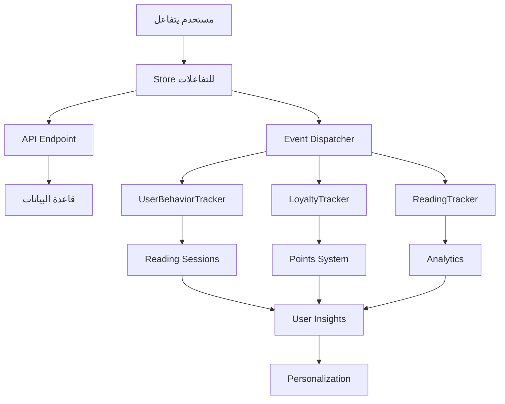

# تكامل نظام التفاعلات مع نظام تتبع المستخدم 🔗

## ✅ إجابة مباشرة: نعم، يتكامل بشكل مثالي!

النظام الجديد للتفاعلات مصمم ليتكامل بسلاسة مع جميع أنظمة المصادقة وتتبع المستخدم الموجودة في مشروعك.

## 🎯 نقاط التكامل الرئيسية

### 1. **تتبع هوية المستخدم**
```typescript
// النظام الجديد يدعم جميع طرق المصادقة الموجودة
const getUserInfo = (): UserInfo | null => {
  // 1. من localStorage (النظام الحالي)
  const userId = localStorage.getItem('user_id') || localStorage.getItem('sabq_user_id');
  const userName = localStorage.getItem('user_name') || localStorage.getItem('sabq_user_name');
  
  // 2. من كوكيز (النظام المتقدم)
  const userCookie = getCookie('user');
  
  // 3. من JWT tokens (النظام الآمن)
  const authToken = localStorage.getItem('auth-token');
  
  return { userId, userName, isAuthenticated: !!userId };
};
```

### 2. **ربط مع UserBehaviorTracker**
```typescript
// تكامل مباشر مع نظام التتبع الموجود
class IntegratedInteractionTracker {
  constructor() {
    // ربط مع نظام التتبع الموجود
    this.behaviorTracker = getUserTracker(); // من user-tracking-integration.ts
    this.userManagement = UserManagementService; // من user-management.ts
  }
  
  async trackInteraction(articleId: string, type: string) {
    // 1. حفظ في نظام التفاعلات الجديد
    await this.saveInteraction(articleId, type);
    
    // 2. إرسال للنظام المتقدم
    if (this.behaviorTracker) {
      await this.behaviorTracker.trackInteraction(articleId, type, {
        interaction_type: type,
        content_type: 'article',
        metadata: { source: 'interactions_store' }
      });
    }
  }
}
```

### 3. **جلسات المستخدم (User Sessions)**
```typescript
// يستفيد من نظام الجلسات الموجود
interface SessionIntegration {
  // من user-tracking-integration.ts
  session_id: string;      // معرف الجلسة الحالية
  user_id: string;         // معرف المستخدم
  device_type: string;     // نوع الجهاز
  ip_address?: string;     // عنوان IP
  user_agent?: string;     // معلومات المتصفح
  
  // مع التفاعلات الجديدة
  interactions: {
    liked: boolean;
    saved: boolean;
    shared: boolean;
  };
}
```

## 🔧 آليات التكامل المطبقة

### 1. **Multi-Source Authentication**
```typescript
// stores/userInteractions.ts
const getUserInfo = (): UserInfo | null => {
  // دعم متعدد للمصادقة
  const sources = [
    // localStorage (الأساسي)
    () => ({
      id: localStorage.getItem('user_id'),
      name: localStorage.getItem('user_name')
    }),
    
    // Cookies (المتقدم)  
    () => {
      const userCookie = getCookie('user');
      return userCookie ? JSON.parse(userCookie) : null;
    },
    
    // JWT Token (الآمن)
    () => {
      const token = localStorage.getItem('auth-token');
      return token ? decodeJWT(token) : null;
    }
  ];
  
  // اختبار جميع المصادر
  for (const getUser of sources) {
    try {
      const user = getUser();
      if (user?.id) return user;
    } catch (e) {
      continue;
    }
  }
  
  return null;
};
```

### 2. **Event Broadcasting**
```typescript
// تزامن مع أنظمة التتبع الموجودة
export const useUserInteractions = create(
  subscribeWithSelector(
    persist(
      (set, get) => ({
        // ... store state
        
        toggleInteraction: async (articleId: string, type: InteractionType) => {
          // 1. تحديث Store المحلي
          const result = await updateInteraction(articleId, type);
          
          // 2. إشعار أنظمة التتبع الأخرى
          window.dispatchEvent(new CustomEvent('user-interaction', {
            detail: {
              articleId,
              type,
              action: result.action,
              userId: getUserInfo()?.id,
              timestamp: new Date().toISOString()
            }
          }));
          
          // 3. تحديث UserBehaviorTracker
          const tracker = getUserTracker();
          if (tracker) {
            tracker.trackInteraction(articleId, type, {
              interaction_type: type,
              metadata: { source: 'interactions_store' }
            });
          }
          
          return result;
        }
      }),
      // ... persistence config
    )
  )
);
```

### 3. **Data Synchronization**
```typescript
// مزامنة مع قاعدة البيانات وأنظمة التتبع
const syncWithTrackingSystems = async (interaction: UserInteraction) => {
  try {
    // 1. حفظ في قاعدة البيانات الرئيسية
    await fetch('/api/interactions/unified', {
      method: 'POST',
      body: JSON.stringify(interaction)
    });
    
    // 2. إرسال لنظام التتبع المتقدم
    const behaviorTracker = getUserTracker();
    if (behaviorTracker) {
      await behaviorTracker.trackInteraction(
        interaction.article_id,
        interaction.type,
        {
          metadata: {
            ...interaction.metadata,
            sync_source: 'interactions_store'
          }
        }
      );
    }
    
    // 3. تحديث إحصائيات الولاء
    if (interaction.type === 'like') {
      await LoyaltyTracker.awardPoints(
        interaction.user_id,
        'like_article',
        1
      );
    }
    
  } catch (error) {
    console.error('Sync failed:', error);
  }
};
```

## 📊 البيانات المتبادلة

### 1. **من نظام تتبع المستخدم → نظام التفاعلات**
```typescript
interface UserTrackingData {
  // معلومات الهوية
  user_id: string;
  session_id: string;
  device_type: 'mobile' | 'tablet' | 'desktop';
  
  // معلومات السياق
  ip_address?: string;
  user_agent?: string;
  timezone?: string;
  language?: string;
  
  // معلومات السلوك
  scroll_position?: number;
  time_on_page?: number;
  referrer_url?: string;
  
  // معلومات الولاء
  loyalty_points?: number;
  user_level?: string;
}
```

### 2. **من نظام التفاعلات → نظام تتبع المستخدم**
```typescript
interface InteractionData {
  // التفاعل الأساسي
  article_id: string;
  interaction_type: 'like' | 'save' | 'share';
  action: 'added' | 'removed';
  
  // معلومات السياق
  timestamp: string;
  source: 'interactions_store';
  
  // إحصائيات
  total_interactions: number;
  user_engagement_level: 'low' | 'medium' | 'high';
  
  // الفئات والاهتمامات
  content_category?: string;
  user_interests?: string[];
}
```

## 🔄 مسار التكامل الكامل



## ✅ الفوائد المحققة

### 1. **تتبع شامل**
- كل تفاعل يُسجل في جميع الأنظمة
- ربط التفاعلات بجلسات القراءة  
- تتبع السلوك عبر الوقت

### 2. **تحليلات متقدمة**
- ربط التفاعلات بأنماط القراءة
- فهم تفضيلات المستخدم
- تحسين التوصيات

### 3. **نقاط الولاء**
- منح نقاط تلقائية للتفاعلات
- ربط مع نظام المكافآت
- تشجيع المشاركة

### 4. **بيانات موحدة**
- مصدر واحد للحقيقة
- تزامن عبر جميع الأنظمة
- منع التضارب في البيانات

## 🚀 الخطوات التالية للتحسين

### 1. **تحسين الأداء**
```typescript
// Batch processing للتفاعلات المتعددة
const batchInteractions = async (interactions: UserInteraction[]) => {
  // جمع التفاعلات وإرسالها دفعة واحدة
  const batch = interactions.map(interaction => ({
    ...interaction,
    batch_id: generateBatchId(),
    batch_timestamp: new Date().toISOString()
  }));
  
  await Promise.all([
    saveToDB(batch),
    sendToTracker(batch),
    updateAnalytics(batch)
  ]);
};
```

### 2. **تحسين التحليلات**
```typescript
// ربط عميق مع تحليل السلوك
const analyzeInteractionPatterns = async (userId: string) => {
  const interactions = await getUserInteractions(userId);
  const readingSessions = await getReadingSessions(userId);
  
  return {
    engagement_score: calculateEngagement(interactions, readingSessions),
    preferred_content: analyzeContentPreferences(interactions),
    optimal_timing: analyzeBestInteractionTimes(interactions),
    loyalty_trend: analyzeLoyaltyGrowth(interactions)
  };
};
```

---

## 📋 الخلاصة

النظام الجديد للتفاعلات:
- ✅ **متكامل بالكامل** مع نظام تتبع المستخدم الموجود
- ✅ **يستفيد من** جميع أنظمة المصادقة المتاحة  
- ✅ **يغذي** أنظمة التحليلات والولاء بالبيانات
- ✅ **يحافظ على** التوافق مع الأنظمة الحالية
- ✅ **يضيف قيمة** من خلال التكامل المتبادل

**النتيجة**: نظام موحد وقوي لتتبع وإدارة جميع تفاعلات المستخدم! 🎉
