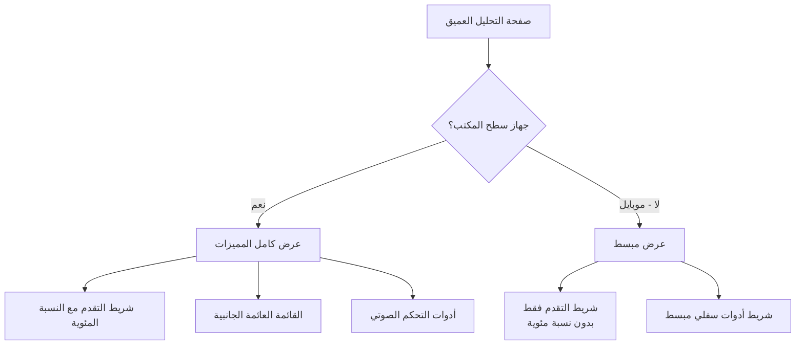

# تحديثات تجربة المستخدم للموبايل - صفحة التحليل العميق

## نظرة عامة

تم تحديث صفحة التحليل العميق (`/insights/deep/[id]`) لتوفير تجربة مستخدم محسنة ومبسطة على الأجهزة المحمولة.

## التغييرات الرئيسية

### 1. إزالة النسبة المئوية من شريط التقدم
- **السابق**: كان يظهر شريط التقدم مع نسبة مئوية (مثل: 45%)
- **الحالي**: شريط تقدم بصري فقط بدون أرقام
- **السبب**: تقليل التشتت البصري والتركيز على المحتوى

### 2. إخفاء القائمة العائمة الجانبية على الموبايل
- **العناصر المحذوفة**:
  - زر وضع القراءة
  - زر ملء الشاشة
  - زر التحليل الذكي
- **السبب**: هذه الأزرار تأخذ مساحة قيمة على الشاشات الصغيرة

### 3. إزالة أدوات التحكم الصوتي من الموبايل
- **العناصر المحذوفة**:
  - زر التشغيل/الإيقاف
  - شريط التحكم بالسرعة
  - شريط التحكم بمستوى الصوت
- **السبب**: تبسيط الواجهة وتحسين الأداء

### 4. تبسيط شريط الأدوات السفلي للموبايل
- **العناصر المتبقية**:
  - فهرس المحتويات
  - المشاركة
  - الإعجاب
- **العناصر المحذوفة**:
  - الاستماع الصوتي
  - وضع القراءة
  - التحليل الذكي

## التفاصيل التقنية

### الملفات المعدلة

1. **`app/insights/deep/[id]/page.tsx`**
   - السطور 740-761: حذف عرض النسبة المئوية
   - السطور 763-821: إضافة شرط `!isMobile` للقائمة العائمة
   - السطور 1240-1340: إضافة شرط `!isMobile` لأدوات الصوت
   - السطور 1390-1440: حذف أزرار الاستماع والقراءة والتحليل

2. **`app/insights/deep/[id]/mobile-styles.css`**
   - حذف أنماط `.mobile-progress-info`
   - حذف أنماط `.mobile-audio-controls`

## مخطط التدفق

## الفوائد المتوقعة

1. **أداء أفضل**: تقليل عدد العناصر التفاعلية يحسن الأداء
2. **تجربة أنظف**: واجهة أقل تشتيتاً تساعد على التركيز في القراءة
3. **سهولة الاستخدام**: الأزرار الأساسية فقط متاحة بسهولة
4. **مساحة أكبر للمحتوى**: إزالة العناصر الفائضة يوفر مساحة أكبر للنص

## ملاحظات للمطورين

- يتم الكشف عن الموبايل باستخدام: `const isMobile = useMediaQuery('(max-width: 768px)');`
- جميع المميزات المحذوفة ما زالت متاحة على سطح المكتب
- شريط التقدم البصري ما زال يعمل ويتحرك مع التمرير 