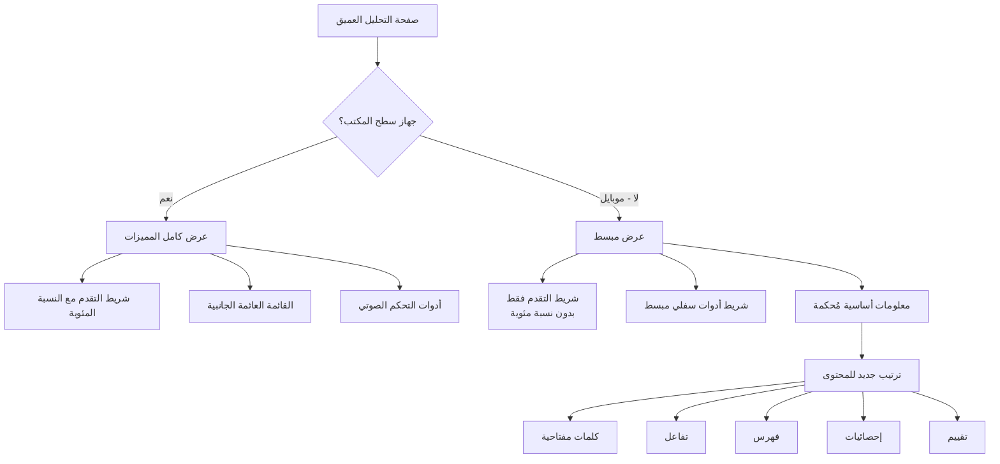

# تحديثات تجربة المستخدم للموبايل - صفحة التحليل العميق

## نظرة عامة

تم تحديث صفحة التحليل العميق (`/insights/deep/[id]`) لتوفير تجربة مستخدم محسنة ومبسطة على الأجهزة المحمولة.

## التغييرات الرئيسية

### 1. إزالة النسبة المئوية من شريط التقدم
- **السابق**: كان يظهر شريط التقدم مع نسبة مئوية (مثل: 45%)
- **الحالي**: شريط تقدم بصري فقط بدون أرقام
- **السبب**: تقليل التشتت البصري والتركيز على المحتوى

### 2. إخفاء القائمة العائمة الجانبية على الموبايل
- **العناصر المحذوفة**:
  - زر وضع القراءة
  - زر ملء الشاشة
  - زر التحليل الذكي
- **السبب**: هذه الأزرار تأخذ مساحة قيمة على الشاشات الصغيرة

### 3. إزالة أدوات التحكم الصوتي من الموبايل
- **العناصر المحذوفة**:
  - زر التشغيل/الإيقاف
  - شريط التحكم بالسرعة
  - شريط التحكم بمستوى الصوت
- **السبب**: تبسيط الواجهة وتحسين الأداء

### 4. تبسيط شريط الأدوات السفلي للموبايل
- **العناصر المتبقية**:
  - فهرس المحتويات
  - المشاركة
  - الإعجاب
- **العناصر المحذوفة**:
  - الاستماع الصوتي
  - وضع القراءة
  - التحليل الذكي

## التحديثات الجديدة (الإصدار 2)

### 5. تحسين تنسيق المعلومات الأساسية
- **التغييرات**:
  - تقليل حجم الخط من `text-sm` إلى `text-xs` 
  - تقليل التباعد من `gap-4` إلى `gap-3`
  - تقليل الحشو من `p-4` إلى `p-3`
  - تقليل حجم الأيقونات من `w-12 h-12` إلى `w-9 h-9`
  - حذف الخلفيات الملونة الإضافية للأيقونات
- **النتيجة**: توفير مساحة أكبر للمحتوى الرئيسي

### 6. إعادة ترتيب العناصر أسفل المحتوى
الترتيب الجديد:
1. **الكلمات المفتاحية** - في أعلى القائمة
2. **تفاعل مع التحليل** - نُقل من الشريط الجانبي إلى أسفل المحتوى
3. **فهرس المحتويات** - نسخة كاملة مع عرض عدد الكلمات الحقيقي
4. **إحصائيات القراءة** - عرض محسّن بثلاثة أعمدة
5. **التقييم** - في آخر القائمة

### 7. إضافة دوال حساب عدد الكلمات
- **`countWords(text: string)`**: لحساب عدد الكلمات في نص عادي
- **`countWordsInElement(element: HTMLElement)`**: لحساب عدد الكلمات في عنصر HTML
- **الاستخدام**: في فهرس المحتويات وإحصائيات القراءة لعرض أرقام دقيقة

### 8. تحسينات إحصائيات القراءة
- **تصميم جديد**: عرض بثلاثة أعمدة (التقدم، الوقت المتبقي، إجمالي الكلمات)
- **ألوان محسّنة**: خلفيات ملونة خفيفة لكل إحصائية
- **معلومات إضافية**: عرض إجمالي عدد الكلمات في المحتوى

## التفاصيل التقنية

### الملفات المعدلة

1. **`app/insights/deep/[id]/page.tsx`**
   - السطور 900-965: تحسين تنسيق المعلومات الأساسية
   - السطور 1000-1060: حذف "تفاعل مع التحليل" من الشريط الجانبي
   - السطور 1170-1380: إضافة الأقسام الجديدة أسفل المحتوى
   - السطور 100-118: إضافة دوال حساب الكلمات

2. **`app/insights/deep/[id]/mobile-styles.css`**
   - إضافة أنماط `.mobile-info-*` للمعلومات الأساسية
   - تحديث أنماط العناصر المحسّنة

## مخطط التدفق

## الفوائد المتوقعة

1. **أداء أفضل**: تقليل عدد العناصر التفاعلية يحسن الأداء
2. **تجربة أنظف**: واجهة أقل تشتيتاً تساعد على التركيز في القراءة
3. **سهولة الاستخدام**: الأزرار الأساسية فقط متاحة بسهولة
4. **مساحة أكبر للمحتوى**: إزالة العناصر الفائضة يوفر مساحة أكبر للنص
5. **معلومات دقيقة**: عرض عدد الكلمات الحقيقي بدلاً من التقديرات

## ملاحظات للمطورين

- يتم الكشف عن الموبايل باستخدام: `const isMobile = useMediaQuery('(max-width: 768px)');`
- جميع المميزات المحذوفة ما زالت متاحة على سطح المكتب
- شريط التقدم البصري ما زال يعمل ويتحرك مع التمرير
- دوال حساب الكلمات تزيل علامات HTML قبل الحساب للدقة 