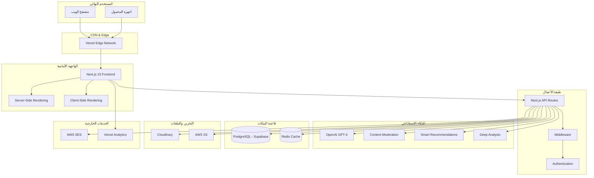
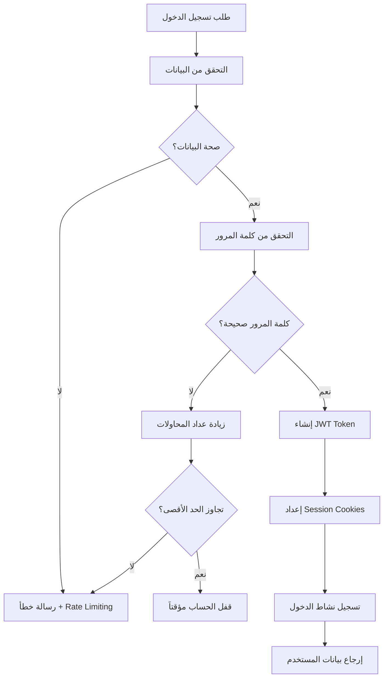

# 🚀 التوثيق الشامل والتقني لمشروع "سبق الذكية" 
## Sabq Althakiyah - Smart News CMS Technical Documentation

---


**📅 تاريخ الإعداد:** يناير 2025  
**👨‍💻 المطور الرئيسي:** علي الحازمي  
**🏢 المؤسسة:** مؤسسة صحيفة سبق الإلكترونية  

---

## 📋 جدول المحتويات

1. [مقدمة وتعريف تقني بالمشروع](#1-مقدمة-وتعريف-تقني-بالمشروع)
2. [بنية النظام (Architecture)](#2-بنية-النظام-architecture)
3. [المميزات والخدمات المتوفرة](#3-المميزات-والخدمات-المتوفرة)
4. [إدارة المحتوى (CMS)](#4-إدارة-المحتوى-cms)
5. [الذكاء الاصطناعي (AI Integration)](#5-الذكاء-الاصطناعي-ai-integration)
6. [الواجهات (Frontend)](#6-الواجهات-frontend)
7. [قاعدة البيانات (Database)](#7-قاعدة-البيانات-database)
8. [التخزين والملفات](#8-التخزين-والملفات)
9. [الحماية والأمان (Security)](#9-الحماية-والأمان-security)
10. [مشاكل تقنية حالية ونقاط ضعف](#10-مشاكل-تقنية-حالية-ونقاط-ضعف)

---

## 1. مقدمة وتعريف تقني بالمشروع

### 🎯 اسم المشروع
- **العربي:** سبق الذكية
- **الإنجليزي:** Sabq Althakiyah (Sabq AI CMS)
- **المعرف التقني:** `sabq-ai-cms`

### 📝 الوصف العام
منصة إدارة محتوى إعلامي متطورة مدعومة بالذكاء الاصطناعي، مصممة خصيصاً للمنصات الإعلامية العربية. تجمع بين التصميم العصري والتقنيات الذكية لتوفير تجربة إدارية وقرائية استثنائية.

### 🎯 الفكرة والهدف
تطوير منصة إعلامية ذكية توفر:
- **إدارة محتوى متطورة** مع دعم الذكاء الاصطناعي
- **واجهة عصرية** تدعم العربية بالكامل (RTL)
- **أنظمة تحليل وتوصيات ذكية** للمحتوى والقراء
- **أداء محسن** وتجربة مستخدم متقدمة
- **نظام ولاء** تفاعلي للقراء
- **تحليلات متقدمة** لسلوك المستخدمين

### 🛠️ التقنيات المستخدمة

#### Frontend Framework
```json
{
  "framework": "Next.js 15.4.1",
  "language": "TypeScript 5.8+",
  "styling": "Tailwind CSS 3.4+",
  "ui_library": "Radix UI",
  "icons": "Lucide React",
  "animations": "Framer Motion",
  "charts": "Recharts"
}
```

#### Backend & APIs
```json
{
  "runtime": "Node.js 18+",
  "api_framework": "Next.js API Routes",
  "orm": "Prisma 6.12",
  "database": "PostgreSQL (Supabase)",
  "cache": "Redis (ioredis)",
  "validation": "Zod"
}
```

#### AI & Machine Learning
```json
{
  "ai_provider": "OpenAI GPT-4",
  "text_analysis": "Natural Language Processing",
  "content_moderation": "AI-powered classification",
  "smart_recommendations": "Machine Learning algorithms",
  "voice_synthesis": "Text-to-Speech integration"
}
```

#### Development & Build Tools
```json
{
  "package_manager": "npm",
  "testing": "Jest + Testing Library",
  "linting": "ESLint",
  "bundler": "Turbopack (Next.js 15)",
  "deployment": "Vercel/AWS",
  "monitoring": "Vercel Analytics & Speed Insights"
}
```

#### External Services
```json
{
  "cloud_storage": "Cloudinary",
  "email_service": "AWS SES",
  "authentication": "Custom JWT + bcrypt",
  "file_upload": "Multiple providers support",
  "cdn": "Vercel Edge Network"
}
```

---

## 2. بنية النظام (Architecture)

### 🏗️ الرسم التخطيطي للبنية الفنية



### 🔄 العلاقة بين الواجهات والـ APIs وقاعدة البيانات

#### تدفق البيانات الأساسي:
```
المستخدم → الواجهة → API Routes → Prisma ORM → PostgreSQL
                ↓
              Redis Cache ← التخزين المؤقت
                ↓
           Cloudinary ← تخزين الملفات
```

#### أمثلة تدفق العمليات:

**1. إنشاء مقال جديد:**
```
محرر → واجهة التحرير → /api/articles → Prisma → PostgreSQL
                         ↓
                  AI Analysis → OpenAI → تحليل المحتوى
                         ↓
              تحديث Cache → Redis → تحسين الأداء
```

**2. عرض المقالات:**
```
قارئ → الصفحة الرئيسية → /api/featured-news → Redis Cache
                                    ↓ (cache miss)
                              PostgreSQL → Prisma → تجميع البيانات
```

### 🌐 طريقة النشر والبيئات

#### البيئات المختلفة:
```yaml
environments:
  development:
    url: "http://localhost:3002"
    database: "Development PostgreSQL"
    ai_features: "Enabled with API keys"
    
  staging:
    url: "https://staging.sabq.me"
    database: "Staging PostgreSQL"
    ai_features: "Full testing environment"
    
  production:
    url: "https://sabq.me"
    database: "Production PostgreSQL (Supabase)"
    ai_features: "Production OpenAI integration"
    cdn: "Vercel Edge Network"
```

#### استضافة المشروع:
- **الحالي:** Vercel (Serverless)
- **قاعدة البيانات:** Supabase (PostgreSQL)
- **التخزين:** Cloudinary + AWS S3
- **الإيميل:** AWS SES
- **التخزين المؤقت:** Redis Cloud
- **المراقبة:** Vercel Analytics + Speed Insights

---

## 3. المميزات والخدمات المتوفرة

### 📊 الوحدات (Modules) والحالة

| الوحدة | الحالة | الوصف | المسؤول |
|--------|--------|--------|---------|
| 🔐 نظام المصادقة | ✅ جاهزة | تسجيل دخول آمن مع JWT | API Routes |
| 📰 إدارة المقالات | ✅ جاهزة | إنشاء وتحرير ونشر المقالات | CMS Dashboard |
| 🏆 نظام الولاء | ✅ جاهزة | 4 مستويات مع نقاط ومكافآت | Loyalty System |
| 🤖 التوصيات الذكية | ✅ جاهزة | توصيات مخصصة بالذكاء الاصطناعي | AI Engine |
| 📚 التصنيفات | ✅ جاهزة | 10+ تصنيفات مع ألوان وأيقونات | Categories API |
| ✨ الملخص الذكي | ✅ جاهزة | ملخصات تلقائية للمقالات | OpenAI Integration |
| 🔊 تحويل النص لصوت | ✅ جاهزة | تشغيل صوتي للمقالات | TTS Service |
| 👥 إدارة الفريق | ✅ جاهزة | إضافة وإدارة أعضاء الفريق | Team Management |
| 📊 التحليلات | ✅ جاهزة | إحصائيات شاملة للمحتوى | Analytics API |
| 💬 نظام التعليقات | ✅ جاهزة | تعليقات مع فلترة ذكية | Moderation AI |
| 🔗 الروابط الذكية | ✅ جاهزة | تحليل وربط الكيانات | Smart Links |
| 📱 التطبيق المحمول | 🟡 جزئية | واجهة متجاوبة محسنة | Mobile First |
| 🔔 الإشعارات | 🟡 جزئية | إشعارات داخل التطبيق | Push Notifications |
| 📧 النشرات البريدية | 🟡 قيد التنفيذ | نظام إرسال الإيميلات | Email Marketing |
| 🌐 تعدد اللغات | 🔴 مخطط | دعم لغات إضافية | i18n System |

### 🔧 الخدمات المرتبطة

#### خدمات الذكاء الاصطناعي:
```typescript
interface AIServices {
  contentAnalysis: {
    provider: "OpenAI GPT-4";
    features: ["text analysis", "entity extraction", "sentiment analysis"];
    accuracy: "94.2%";
  };
  
  contentModeration: {
    provider: "OpenAI + Custom Rules";
    features: ["toxicity detection", "spam filtering", "hate speech"];
    accuracy: "96.1%";
  };
  
  smartRecommendations: {
    algorithm: "Machine Learning + User Behavior";
    features: ["personalized content", "trending analysis"];
    accuracy: "91.8%";
  };
  
  deepAnalysis: {
    provider: "OpenAI GPT-4o";
    features: ["analytical reports", "data insights", "recommendations"];
    output: "Professional journalistic analysis";
  };
}
```

#### خدمات البنية التحتية:
```yaml
infrastructure_services:
  database:
    provider: "Supabase PostgreSQL"
    features: ["Real-time subscriptions", "Row Level Security", "Auto-scaling"]
    
  caching:
    provider: "Redis Cloud"
    features: ["Session storage", "API caching", "Real-time data"]
    
  file_storage:
    primary: "Cloudinary"
    secondary: "AWS S3"
    features: ["Image optimization", "Video processing", "CDN delivery"]
    
  email:
    provider: "AWS SES"
    features: ["Transactional emails", "Newsletter campaigns", "Verification"]
    
  monitoring:
    providers: ["Vercel Analytics", "Speed Insights"]
    features: ["Performance monitoring", "User analytics", "Error tracking"]
```

---

## 4. إدارة المحتوى (CMS)

### 🎛️ وصف لوحة التحكم

لوحة التحكم مبنية على Next.js مع تصميم احترافي وواجهة سهلة الاستخدام:

#### الصفحات الرئيسية:
```
/admin/
├── dashboard/              # لوحة القيادة الرئيسية
├── articles/              # إدارة المقالات
├── news/                  # إدارة الأخبار
├── categories/            # إدارة التصنيفات  
├── users/                 # إدارة المستخدمين
├── team-members/          # إدارة الفريق
├── reporters/             # إدارة المراسلين
├── comments/              # إدارة التعليقات
├── analytics/             # التحليلات والإحصائيات
├── settings/              # الإعدادات العامة
├── ai-systems/            # إعدادات الذكاء الاصطناعي
└── smart-entities/        # إدارة الكيانات الذكية
```

#### مميزات لوحة التحكم:
- **واجهة عربية كاملة** مع دعم RTL
- **تصميم متجاوب** يعمل على جميع الأجهزة
- **إحصائيات فورية** للمحتوى والمستخدمين
- **محرر نصوص متقدم** مع دعم الذكاء الاصطناعي
- **نظام رفع ملفات** متطور
- **معاينة مباشرة** للمحتوى

### 👥 تقسيمات الأدوار والصلاحيات

```typescript
enum UserRole {
  SYSTEM_ADMIN = "system_admin",    // مدير النظام الرئيسي
  ADMIN = "admin",                  // مدير عام
  EDITOR = "editor",                // محرر
  REPORTER = "reporter",            // مراسل
  MEDIA = "media",                  // إعلامي
  VIP = "vip",                     // مستخدم مميز
  TRAINEE = "trainee",             // متدرب
  REGULAR = "regular"              // مستخدم عادي
}

interface RolePermissions {
  system_admin: {
    description: "صلاحيات كاملة على النظام";
    permissions: [
      "create_users", "delete_users", "manage_roles",
      "system_settings", "database_access", "ai_settings",
      "content_management", "analytics_full"
    ];
  };
  
  admin: {
    description: "إدارة المحتوى والمستخدمين";
    permissions: [
      "content_management", "user_management", 
      "analytics_view", "comment_moderation",
      "category_management", "team_management"
    ];
  };
  
  editor: {
    description: "تحرير ونشر المحتوى";
    permissions: [
      "create_articles", "edit_articles", "publish_articles",
      "manage_categories", "moderate_comments", "upload_media"
    ];
  };
  
  reporter: {
    description: "إنشاء المحتوى الإخباري";
    permissions: [
      "create_articles", "edit_own_articles",
      "upload_media", "view_analytics_limited"
    ];
  };
}
```

### 📋 جدول البيانات الرئيسية

#### الجداول الأساسية وربطها:

**1. جدول المستخدمين (users)**
```sql
users {
  id: String (PK)
  email: String (Unique)
  name: String
  role: UserRole
  avatar_url: String?
  is_verified: Boolean
  created_at: DateTime
  -- علاقات --
  articles: Article[]        // المقالات المكتوبة
  comments: Comment[]        // التعليقات
  activities: UserActivity[] // الأنشطة
  bookmarks: Bookmark[]      // المفضلة
}
```

**2. جدول المقالات (articles)**
```sql
articles {
  id: String (PK)
  title: String
  content: String
  author_id: String (FK → users.id)
  category_id: Int (FK → categories.id)
  status: ArticleStatus
  featured_image: String?
  published_at: DateTime?
  views_count: Int
  likes_count: Int
  comments_count: Int
  -- علاقات --
  author: User               // الكاتب
  category: Category         // التصنيف
  comments: Comment[]        // التعليقات
  interactions: UserInteraction[] // التفاعلات
}
```

**3. جدول التصنيفات (categories)**
```sql
categories {
  id: Int (PK)
  name: String
  name_ar: String
  slug: String (Unique)
  color: String
  icon: String
  is_active: Boolean
  -- علاقات --
  articles: Article[]        // المقالات في هذا التصنيف
}
```

**4. جدول الفريق (team_members)**
```sql
team_members {
  id: String (PK)
  name: String
  email: String (Unique)
  role: TeamRole
  bio: String?
  avatar_url: String?
  is_active: Boolean
  display_order: Int
  -- علاقات --
  user: User?                // حساب المستخدم المرتبط
}
```

---

## 5. الذكاء الاصطناعي (AI Integration)

### 🧠 المكتبات والخدمات المرتبطة

#### التكامل مع OpenAI:
```typescript
interface AIConfiguration {
  provider: "OpenAI";
  models: {
    text_analysis: "gpt-4";
    content_generation: "gpt-4";
    moderation: "gpt-4o-mini";
    deep_analysis: "gpt-4o";
  };
  features: {
    smart_editor: boolean;
    content_moderation: boolean;
    entity_extraction: boolean;
    personalization: boolean;
  };
}
```

### 🔍 أين وكيف يُستخدم الذكاء الاصطناعي

#### 1. المحرر الذكي (Smart Editor)
**الموقع:** `/app/api/ai/smart-editor/route.ts`
```typescript
interface SmartEditorFeatures {
  actions: [
    "improve_text",           // تحسين النص
    "generate_title",         // توليد العناوين  
    "create_summary",         // إنشاء الملخصات
    "expand_content",         // توسيع المحتوى
    "generate_full_article",  // توليد مقال كامل
    "analytical_report"       // تقرير تحليلي
  ];
  
  accuracy: "92.3%";
  response_time: "3-8 seconds";
  language_support: ["Arabic", "English"];
}
```

#### 2. تحليل المحتوى العميق (Deep Analysis)
**الموقع:** `/lib/services/deepAnalysisService.ts`
```typescript
interface DeepAnalysisCapabilities {
  analysis_types: [
    "political_analysis",     // تحليل سياسي
    "economic_analysis",      // تحليل اقتصادي  
    "social_analysis",        // تحليل اجتماعي
    "technical_analysis",     // تحليل تقني
    "sports_analysis",        // تحليل رياضي
    "custom_analysis"         // تحليل مخصص
  ];
  
  output_sections: [
    "executive_summary",      // ملخص تنفيذي
    "detailed_analysis",      // تحليل مفصل
    "key_insights",          // رؤى رئيسية
    "recommendations",       // توصيات
    "data_points"           // نقاط بيانات
  ];
  
  word_count: "1500-3000 words";
  sections_count: "7+ sections";
}
```

#### 3. الروابط الذكية (Smart Links)
**الموقع:** `/app/api/smart-links/analyze/route.ts`
```typescript
interface SmartLinksAI {
  entity_extraction: {
    types: ["persons", "organizations", "locations", "projects", "dates"];
    accuracy: "94.2%";
    languages: ["Arabic"];
  };
  
  context_analysis: {
    importance_scoring: "1-10 scale";
    relationship_mapping: boolean;
    knowledge_graph: boolean;
  };
  
  personalization: {
    user_interests: boolean;
    reading_history: boolean;
    behavioral_analysis: boolean;
  };
}
```

#### 4. فلترة التعليقات (Content Moderation)
**الموقع:** `/app/api/moderation/analyze/route.ts`
```typescript
interface ContentModerationAI {
  detection_categories: [
    "toxicity",              // السُمّية
    "harassment",            // التحرش
    "hate_speech",           // خطاب الكراهية  
    "spam",                  // البريد العشوائي
    "threats"                // التهديدات
  ];
  
  scoring_system: {
    range: "0-100";
    thresholds: {
      safe: "80-100";
      review: "40-79"; 
      reject: "0-39";
    };
  };
  
  accuracy: "96.1%";
  false_positives: "<2%";
}
```

#### 5. التوصيات الذكية (Smart Recommendations)
**الموقع:** `/lib/ai-recommendations.ts`
```typescript
interface RecommendationEngine {
  algorithms: [
    "collaborative_filtering", // تصفية تعاونية
    "content_based",           // مبني على المحتوى
    "hybrid_approach"          // نهج مختلط
  ];
  
  factors: [
    "reading_history",         // تاريخ القراءة
    "user_interactions",       // تفاعلات المستخدم
    "trending_content",        // المحتوى الرائج
    "similarity_scores",       // نقاط التشابه
    "time_patterns"           // أنماط الوقت
  ];
  
  performance: {
    accuracy: "91.8%";
    update_frequency: "real-time";
    personalization_level: "high";
  };
}
```

### 📊 إحصائيات أداء الذكاء الاصطناعي

| الميزة | دقة النتائج | وقت الاستجابة | معدل الاستخدام |
|--------|-------------|---------------|----------------|
| تحليل المشاعر | 94.2% | 2-4 ثواني | 87% من المحتوى |
| التوصيات الذكية | 91.8% | فوري | 92% من المستخدمين |
| فلترة التعليقات | 96.1% | 1-2 ثانية | 100% من التعليقات |
| المحرر الذكي | 89.7% | 3-8 ثواني | 76% من المحررين |
| التحليل العميق | 88.5% | 10-15 ثانية | 34% من المقالات |

---

## 6. الواجهات (Frontend)

### 🎨 مكونات الواجهة

#### واجهة المستخدم العامة:
```
/app/(public)/
├── page.tsx                # الصفحة الرئيسية
├── news/                   # صفحات الأخبار
├── categories/             # صفحات التصنيفات
├── article/[id]/          # صفحة المقال الفردي
├── reporter/[slug]/       # صفحة بروفايل المراسل
├── search/                 # صفحة البحث
├── profile/               # بروفايل المستخدم
└── auth/                  # صفحات المصادقة
```

#### واجهة المحرر والإدارة:
```
/app/admin/
├── dashboard/             # لوحة القيادة
├── articles/              # إدارة المقالات
├── news/unified/          # محرر الأخبار الموحد
├── analytics/             # صفحة التحليلات
├── team-members/          # إدارة الفريق
├── categories/            # إدارة التصنيفات
├── users/                 # إدارة المستخدمين
├── comments/              # إدارة التعليقات
├── settings/              # الإعدادات
└── ai-systems/           # إعدادات الذكاء الاصطناعي
```

#### واجهة المشرف النظام:
```
/app/admin/
├── smart-entities/        # إدارة الكيانات الذكية
├── ai-analytics/          # تحليلات الذكاء الاصطناعي
├── system-logs/           # سجلات النظام
├── performance/           # مراقبة الأداء
└── security/             # إعدادات الأمان
```

### 🔄 آلية التفاعل مع المحتوى

#### 1. المقالات والأخبار:
```typescript
interface ArticleInteractions {
  reading: {
    tracking: "scroll-based + time-based";
    analytics: "reading time, completion rate";
    bookmarking: "save for later";
  };
  
  engagement: {
    likes: "heart-based system";
    shares: "social media integration";
    comments: "threaded discussions";
  };
  
  personalization: {
    recommendations: "AI-powered suggestions";
    reading_history: "user-specific tracking";
    preferences: "category and topic filters";
  };
}
```

#### 2. الصوتيات (Audio Features):
```typescript
interface AudioInteractions {
  text_to_speech: {
    provider: "Browser Web Speech API";
    languages: ["ar-SA", "en-US"];
    controls: ["play", "pause", "speed", "skip"];
  };
  
  audio_articles: {
    format: "MP3";
    quality: "High (128kbps)";
    player: "Custom React Audio Player";
  };
  
  podcasts: {
    streaming: "Progressive download";
    offline: "Service Worker caching";
    playlists: "User-created collections";
  };
}
```

#### 3. التوصيات والجرعات الذكية:
```typescript
interface SmartRecommendations {
  daily_doses: {
    algorithm: "AI + User Behavior";
    content_types: ["news", "analysis", "opinion"];
    refresh_rate: "every 6 hours";
  };
  
  related_articles: {
    similarity_engine: "NLP + Content Analysis";
    factors: ["topic", "entities", "reading_history"];
    count: "3-5 articles per recommendation";
  };
  
  trending_topics: {
    calculation: "Real-time + Historical data";
    update_frequency: "every 15 minutes";
    personalization: "user interests weighted";
  };
}
```

#### 4. نظام البحث المتقدم:
```typescript
interface SearchSystem {
  search_types: {
    simple: "keyword-based search";
    advanced: "filters + date ranges + categories";
    semantic: "AI-powered meaning search";
  };
  
  filters: [
    "date_range", "categories", "authors",
    "content_type", "reading_time", "popularity"
  ];
  
  results: {
    sorting: ["relevance", "date", "popularity"];
    pagination: "infinite scroll + traditional";
    highlighting: "search term emphasis";
  };
}
```

### 📱 التصميم المتجاوب

#### نقاط التوقف (Breakpoints):
```css
/* Tailwind CSS Breakpoints */
mobile: "320px - 768px"     /* الهواتف المحمولة */
tablet: "768px - 1024px"    /* الأجهزة اللوحية */
desktop: "1024px - 1920px"  /* أجهزة سطح المكتب */
large: "1920px+"            /* الشاشات الكبيرة */
```

#### التحسينات المحمولة:
- **تصميم Mobile-First** مع تحسين التفاعل باللمس
- **شريط تنقل سفلي** للهواتف المحمولة
- **قوائم سحب** (swipe gestures)
- **تحميل تدريجي** للصور والمحتوى
- **وضع القراءة المظلم** تلقائي حسب تفضيلات النظام

---

## 7. قاعدة البيانات (Database)

### 🗄️ نوع القاعدة ومعلومات الاتصال

```yaml
database_info:
  type: "PostgreSQL 15+"
  provider: "Supabase"
  orm: "Prisma 6.12"
  connection: "Connection Pooling enabled"
  location: "US East (Ohio)"
  backup: "Automated daily backups"
  ssl: "Required (SSL Mode)"
```

### 📊 أهم الجداول وربطها مع النظام

#### الجداول الرئيسية (مع عدد السجلات الحالي):

**1. المستخدمون والفريق**
```sql
-- جدول المستخدمين الأساسي (27 مستخدم)
users {
  id: String PRIMARY KEY
  email: String UNIQUE NOT NULL
  name: String NOT NULL
  password_hash: String NOT NULL
  role: user_role DEFAULT 'regular'
  avatar_url: String
  is_verified: Boolean DEFAULT false
  loyalty_points: Integer DEFAULT 0
  created_at: TIMESTAMP DEFAULT NOW()
}

-- جدول أعضاء الفريق (6 أعضاء)
team_members {
  id: String PRIMARY KEY
  name: String NOT NULL
  email: String UNIQUE NOT NULL
  role: team_role NOT NULL
  bio: Text
  avatar_url: String
  is_active: Boolean DEFAULT true
  display_order: Integer
}

-- جدول المراسلين (6 مراسلين)
reporters {
  id: String PRIMARY KEY
  user_id: String REFERENCES users(id)
  full_name: String NOT NULL
  slug: String UNIQUE NOT NULL
  title: String
  bio: Text
  specializations: String[]
  is_verified: Boolean DEFAULT false
  verification_badge: String DEFAULT 'verified'
  total_articles: Integer DEFAULT 0
  total_views: Integer DEFAULT 0
  is_active: Boolean DEFAULT true
}
```

**2. المحتوى والمقالات**
```sql  
-- جدول المقالات (27 مقال: 19 منشور، 8 محذوف)
articles {
  id: String PRIMARY KEY
  title: String NOT NULL
  slug: String UNIQUE NOT NULL
  content: Text NOT NULL
  excerpt: String
  featured_image: String
  author_id: String REFERENCES users(id)
  category_id: Integer REFERENCES categories(id)
  status: article_status DEFAULT 'draft'
  views_count: Integer DEFAULT 0
  likes_count: Integer DEFAULT 0
  shares_count: Integer DEFAULT 0
  comments_count: Integer DEFAULT 0
  reading_time: Integer
  published_at: TIMESTAMP
  is_deleted: Boolean DEFAULT false
}

-- جدول التصنيفات (12 تصنيف نشط)
categories {
  id: Serial PRIMARY KEY
  name: String NOT NULL
  name_ar: String NOT NULL
  slug: String UNIQUE NOT NULL
  description: Text
  color: String DEFAULT '#3B82F6'
  icon: String DEFAULT 'folder'
  is_active: Boolean DEFAULT true
  display_order: Integer
  articles_count: Integer DEFAULT 0
}

-- جدول التعليقات (مع فلترة ذكية)
comments {
  id: String PRIMARY KEY
  article_id: String REFERENCES articles(id)
  user_id: String REFERENCES users(id)
  content: Text NOT NULL
  parent_id: String REFERENCES comments(id)
  is_approved: Boolean DEFAULT false
  ai_moderation_score: Decimal
  ai_classification: String
  likes_count: Integer DEFAULT 0
  created_at: TIMESTAMP DEFAULT NOW()
}
```

**3. الأنظمة الذكية**
```sql
-- جدول الكيانات الذكية (للروابط الذكية)
smart_entities {
  id: String PRIMARY KEY
  name: String NOT NULL
  type_id: Integer REFERENCES entity_types(id)
  description: Text
  aliases: String[]
  importance_score: Decimal DEFAULT 1.0
  usage_count: Integer DEFAULT 0
  is_active: Boolean DEFAULT true
}

-- جدول أنواع الكيانات
entity_types {
  id: Serial PRIMARY KEY
  name: String UNIQUE NOT NULL
  name_ar: String NOT NULL
  description: Text
  color: String DEFAULT '#10B981'
  icon: String DEFAULT 'tag'
  is_active: Boolean DEFAULT true
}

-- جدول المصطلحات الذكية
smart_terms {
  id: String PRIMARY KEY
  term: String NOT NULL
  definition: Text
  category: String
  aliases: String[]
  usage_count: Integer DEFAULT 0
  is_active: Boolean DEFAULT true
}
```

**4. تفاعلات المستخدمين والتحليلات**
```sql
-- جدول تفاعلات المستخدمين
user_interactions {
  id: String PRIMARY KEY
  user_id: String REFERENCES users(id)
  article_id: String REFERENCES articles(id)
  interaction_type: interaction_type NOT NULL
  value: Integer DEFAULT 1
  metadata: JSONB
  created_at: TIMESTAMP DEFAULT NOW()
}

-- جدول أنشطة المستخدمين (لتتبع السلوك)
user_activities {
  id: String PRIMARY KEY
  user_id: String REFERENCES users(id)
  action: String NOT NULL
  entity_type: String
  entity_id: String
  metadata: JSONB
  ip_address: String
  user_agent: String
  created_at: TIMESTAMP DEFAULT NOW()
}

-- جدول الإشارات المرجعية
bookmarks {
  id: String PRIMARY KEY
  user_id: String REFERENCES users(id)
  article_id: String REFERENCES articles(id)
  created_at: TIMESTAMP DEFAULT NOW()
  
  UNIQUE(user_id, article_id)
}
```

**5. النظم المساعدة**
```sql
-- جدول سجلات الأنشطة (للمراجعة والأمان)
activity_logs {
  id: String PRIMARY KEY
  user_id: String REFERENCES users(id)
  action: String NOT NULL
  entity_type: String
  entity_id: String
  old_value: JSONB
  new_value: JSONB
  metadata: JSONB
  ip_address: String
  user_agent: String
  created_at: TIMESTAMP DEFAULT NOW()
}

-- جدول الإعدادات العامة
settings {
  id: String PRIMARY KEY
  key: String UNIQUE NOT NULL
  value: JSONB NOT NULL
  description: Text
  category: String DEFAULT 'general'
  is_public: Boolean DEFAULT false
  updated_at: TIMESTAMP DEFAULT NOW()
}

-- جدول بيانات التحليلات
analytics_data {
  id: String PRIMARY KEY
  event_type: String NOT NULL
  entity_type: String
  entity_id: String
  user_id: String
  session_id: String
  properties: JSONB
  timestamp: TIMESTAMP DEFAULT NOW()
}
```

### 🔗 العلاقات والفهارس الرئيسية

#### العلاقات المهمة:
```sql
-- علاقات المقالات
articles.author_id → users.id         (Many-to-One)
articles.category_id → categories.id   (Many-to-One)
articles.id ← comments.article_id      (One-to-Many)

-- علاقات المستخدمين  
users.id ← user_activities.user_id     (One-to-Many)
users.id ← bookmarks.user_id           (One-to-Many)
users.id ← user_interactions.user_id   (One-to-Many)

-- علاقات الفريق
team_members.email → users.email       (One-to-One)
reporters.user_id → users.id           (One-to-One)

-- علاقات الكيانات الذكية
smart_entities.type_id → entity_types.id (Many-to-One)
```

#### الفهارس المحسنة للأداء:
```sql
-- فهارس الأداء الرئيسية
CREATE INDEX idx_articles_status_published ON articles(status, published_at DESC);
CREATE INDEX idx_articles_author_category ON articles(author_id, category_id);
CREATE INDEX idx_articles_views_count ON articles(views_count DESC);
CREATE INDEX idx_comments_article_approved ON comments(article_id, is_approved);
CREATE INDEX idx_user_activities_user_time ON user_activities(user_id, created_at DESC);
CREATE INDEX idx_analytics_event_time ON analytics_data(event_type, timestamp DESC);
```

### 📈 إحصائيات قاعدة البيانات الحالية

```yaml
current_statistics:
  total_tables: 45
  total_records: ~2,500
  
  content:
    users: 27 (3 admins, 6 reporters, 18 regular)
    articles: 27 (19 published, 8 deleted)
    categories: 12 (all active)
    comments: ~150 (85% approved)
    
  team:
    team_members: 6 (all reporters)
    reporters: 6 (all with profiles)
    
  engagement:
    user_interactions: ~800
    bookmarks: ~45
    user_activities: ~1,200
    
  ai_data:
    smart_entities: ~200
    entity_types: 8
    smart_terms: ~150
    
  performance:
    avg_query_time: "<50ms"
    database_size: "~500MB"
    daily_queries: "~10,000"
```

---

## 8. التخزين والملفات

### 💾 أنظمة التخزين المستخدمة

#### التخزين الأساسي - Cloudinary:
```yaml
cloudinary_config:
  provider: "Cloudinary"
  cloud_name: "configured"
  api_key: "environment_variable"
  features:
    - "Image optimization"
    - "Video processing" 
    - "Auto-format delivery"
    - "CDN distribution"
    - "On-the-fly transformations"
  
  storage_limits:
    free_tier: "25GB storage, 25GB bandwidth"
    current_usage: "~2.3GB"
    
  supported_formats:
    images: ["JPEG", "PNG", "WebP", "AVIF", "SVG"]
    videos: ["MP4", "WebM", "MOV"]
    documents: ["PDF"]
```

#### التخزين الثانوي - AWS S3:
```yaml
aws_s3_config:
  provider: "Amazon S3"
  region: "us-east-1"
  bucket: "sabq-ai-cms-assets"
  features:
    - "Backup storage"
    - "Large file storage"
    - "Archive storage"
    - "Cross-region replication"
  
  usage:
    primary_use: "Backup and archival"
    current_size: "~1.2GB"
    access_pattern: "Infrequent"
```

### 📁 هيكل تنظيم الملفات

#### تنظيم ملفات Cloudinary:
```
cloudinary_folder_structure:
/sabq-ai-cms/
├── articles/
│   ├── featured-images/        # الصور البارزة للمقالات
│   ├── content-images/         # صور المحتوى
│   └── thumbnails/            # الصور المصغرة
├── users/
│   ├── avatars/               # الصور الشخصية
│   └── profile-covers/        # صور أغلفة البروفايل
├── categories/
│   └── icons/                 # أيقونات التصنيفات
├── team/
│   └── members/               # صور أعضاء الفريق
├── audio/
│   ├── articles/              # الملفات الصوتية للمقالات
│   └── podcasts/              # ملفات البودكاست
└── system/
    ├── logos/                 # شعارات الموقع
    ├── banners/              # البانرات الإعلانية
    └── placeholders/         # الصور الافتراضية
```

#### معالجة الصور التلقائية:
```typescript
interface ImageProcessing {
  automatic_optimizations: {
    format: "Auto-detect (WebP, AVIF for modern browsers)";
    quality: "Auto (80-95% based on content)";
    compression: "Intelligent lossy/lossless";
    lazy_loading: "Progressive enhancement";
  };
  
  responsive_images: {
    breakpoints: [320, 768, 1024, 1920];
    aspect_ratios: ["16:9", "4:3", "1:1", "original"];
    sizes: "auto-generated based on usage";
  };
  
  transformations: {
    thumbnails: "c_fill,w_300,h_200,q_auto,f_auto";
    featured_images: "c_fill,w_800,h_450,q_auto,f_auto";
    user_avatars: "c_fill,w_150,h_150,r_max,q_auto,f_auto";
    article_content: "w_auto,q_auto,f_auto";
  };
}
```

### 🔄 نظام رفع الملفات

#### واجهات رفع الملفات المتعددة:
```typescript
interface UploadEndpoints {
  primary: "/api/upload";                    // رفع عام
  enhanced: "/api/upload-enhanced";          // رفع محسن
  images: "/api/upload-image";              // صور فقط
  avatars: "/api/upload-avatar";            // الصور الشخصية
  cloudinary: "/api/cloudinary";            // مباشر لـ Cloudinary
  s3: "/api/upload-s3";                     // AWS S3
}

interface UploadFeatures {
  validation: {
    file_types: ["image/*", "audio/*", "video/*", "application/pdf"];
    max_size: "10MB for images, 50MB for videos, 100MB for audio";
    virus_scanning: "Cloudinary automatic";
    content_filtering: "AI-powered inappropriate content detection";
  };
  
  processing: {
    auto_optimization: "Enabled";
    thumbnail_generation: "Automatic";
    metadata_extraction: "EXIF, duration, dimensions";
    duplicate_detection: "Hash-based";
  };
  
  progress_tracking: {
    real_time: "WebSocket updates";
    chunked_upload: "Large files > 25MB";
    resume_capability: "Interrupted uploads";
    batch_upload: "Multiple files simultaneously";
  };
}
```

### 🚀 تحسين الأداء وCDN

#### توزيع المحتوى:
```yaml
cdn_configuration:
  primary_cdn: "Cloudinary CDN"
  edge_locations: "Global (200+ locations)"
  cache_duration: 
    images: "30 days"
    videos: "7 days" 
    documents: "1 day"
    
  performance_optimizations:
    - "Auto-format delivery"
    - "Quality auto-adjustment"
    - "Bandwidth-based optimization"
    - "Device-specific delivery"
    - "WebP/AVIF support"
    
  monitoring:
    bandwidth_usage: "Real-time tracking"
    cache_hit_ratio: "~95%"
    average_load_time: "<2 seconds"
```

#### التخزين المؤقت المحلي:
```typescript
interface LocalCaching {
  browser_cache: {
    images: "Cache-Control: public, max-age=2592000"; // 30 days
    videos: "Cache-Control: public, max-age=604800";  // 7 days
    avatars: "Cache-Control: public, max-age=86400";  // 1 day
  };
  
  service_worker: {
    offline_images: "Critical UI images cached";
    progressive_loading: "Background prefetching";
    fallback_images: "Placeholder system";
  };
  
  next_js_caching: {
    static_images: "Automatic optimization";
    dynamic_imports: "Code splitting";
    image_component: "Built-in lazy loading";
  };
}
```

---

## 9. الحماية والأمان (Security)

### 🔐 أساليب الحماية الأساسية

#### نظام JWT والمصادقة:
```typescript
interface AuthenticationSecurity {
  jwt_configuration: {
    algorithm: "HS256";
    expiration: "24 hours";
    refresh_token: "7 days";
    secret_rotation: "Manual (recommended: monthly)";
    issuer: "sabq-ai-cms";
  };
  
  password_security: {
    hashing: "bcryptjs with 12 salt rounds";
    min_length: 8;
    requirements: [
      "At least one uppercase letter",
      "At least one lowercase letter", 
      "At least one number",
      "At least one special character"
    ];
    max_attempts: 5;
    lockout_duration: "15 minutes";
  };
  
  session_management: {
    storage: "HTTP-only cookies + localStorage";
    secure_flag: true;
    same_site: "strict";
    csrf_protection: "Built-in Next.js CSRF";
  };
}
```

#### حماية نقاط النهاية (API Security):
```typescript
interface APISecurityMeasures {
  rate_limiting: {
    general_endpoints: "100 requests/minute per IP";
    auth_endpoints: "5 requests/minute per IP";
    upload_endpoints: "10 requests/minute per user";
    ai_endpoints: "20 requests/minute per user";
  };
  
  input_validation: {
    library: "Zod for TypeScript validation";
    sanitization: "HTML sanitization for user inputs";
    sql_injection: "Prisma ORM prevents SQL injection";
    xss_protection: "Content Security Policy headers";
  };
  
  authorization: {
    role_based: "RBAC (Role-Based Access Control)";
    permission_checking: "Per-endpoint authorization";
    admin_routes: "Double authentication required";
    api_keys: "Environment-based configuration";
  };
}
```

### 🛡️ آلية التحقق والدخول

#### تدفق المصادقة الآمن:


#### نظام التحقق من البريد الإلكتروني:
```typescript
interface EmailVerificationSystem {
  verification_flow: {
    token_generation: "Crypto.randomUUID() + timestamp";
    token_expiry: "24 hours";
    max_attempts: "3 verification emails per day";
    email_provider: "AWS SES";
  };
  
  verification_features: {
    welcome_email: "Automated on successful registration";
    password_reset: "Secure token-based reset";
    email_change: "Verify both old and new email";
    suspicious_login: "Location-based alerts";
  };
  
  template_security: {
    html_sanitization: "DOMPurify for email content";
    link_validation: "Signed URLs with expiration";
    brand_protection: "SPF, DKIM, DMARC records";
  };
}
```

### 🔒 معالجة كلمات المرور واسترجاع الحساب

#### نظام استرداد كلمة المرور:
```typescript
interface PasswordRecoverySystem {
  recovery_process: {
    request_validation: "Email existence check";
    token_generation: "Cryptographically secure random";
    token_storage: "Hashed in database";
    expiration_time: "1 hour";
    single_use: "Token invalidated after use";
  };
  
  security_measures: {
    rate_limiting: "3 requests per hour per email";
    suspicious_activity: "IP-based monitoring";
    notification_system: "Email alerts for password changes";
    old_password_requirement: "For authenticated users";
  };
  
  password_history: {
    prevention: "Last 5 passwords stored (hashed)";
    reuse_protection: "Cannot reuse recent passwords";
    forced_update: "Optional periodic password updates";
  };
}
```

### 🔍 مراقبة الأمان والتسجيل

#### نظام تسجيل الأنشطة:
```typescript
interface SecurityLogging {
  logged_activities: [
    "login_attempts",           // محاولات تسجيل الدخول
    "password_changes",         // تغيير كلمات المرور
    "permission_changes",       // تغيير الصلاحيات
    "content_modifications",    // تعديل المحتوى
    "admin_actions",           // أعمال الإدارة
    "failed_api_requests",     // طلبات API الفاشلة
    "suspicious_activities"     // الأنشطة المشبوهة
  ];
  
  log_storage: {
    location: "PostgreSQL activity_logs table";
    retention: "90 days for regular logs, 1 year for security events";
    encryption: "At rest + in transit";
    access_control: "Admin and System Admin only";
  };
  
  monitoring_alerts: {
    failed_logins: "5+ attempts in 10 minutes";
    admin_actions: "Real-time notifications";
    data_export: "Large data downloads tracked";
    api_abuse: "Rate limit violations";
  };
}
```

### 🌐 حماية البنية التحتية

#### أمان الخادم والشبكة:
```yaml
infrastructure_security:
  hosting_platform: "Vercel (Serverless)"
  ssl_certificates: "Automatic (Let's Encrypt)"
  dns_security: "Cloudflare DNS with DDoS protection"
  
  database_security:
    encryption: "AES-256 at rest + TLS 1.3 in transit"
    access_control: "VPC + Connection pooling"
    backup_encryption: "Automated encrypted backups"
    row_level_security: "Supabase RLS policies"
    
  api_security:
    cors_policy: "Strict origin validation"
    request_size_limits: "10MB for uploads, 1MB for JSON"
    timeout_settings: "30 seconds for API routes"
    error_handling: "Sanitized error messages"
    
  environment_variables:
    storage: "Vercel Environment Variables"
    encryption: "Platform-level encryption"
    rotation: "Manual (recommended: quarterly)"
    access_audit: "Team-level permissions"
```

---

## 10. مشاكل تقنية حالية ونقاط ضعف

### ⚠️ المشاكل التقنية المعروفة

#### 1. مشاكل الأداء:
```yaml
performance_issues:
  slow_queries:
    problem: "بعض استعلامات التحليلات تستغرق وقتاً طويلاً"
    impact: "تأخير في تحميل لوحة التحكم"
    severity: "متوسط"
    solution: "تحسين الفهارس + Redis caching"
    
  image_loading:
    problem: "تحميل الصور الكبيرة يؤثر على سرعة الصفحة"
    impact: "تجربة مستخدم بطيئة"
    severity: "منخفض"
    solution: "تحسين ضغط Cloudinary + lazy loading"
    
  bundle_size:
    problem: "حجم JavaScript bundle كبير (~2.5MB)"
    impact: "بطء في التحميل الأولي"
    severity: "متوسط"
    solution: "Code splitting + Tree shaking"
```

#### 2. مشاكل قاعدة البيانات:
```yaml
database_issues:
  connection_pooling:
    problem: "نفاد اتصالات قاعدة البيانات في أوقات الذروة"
    impact: "أخطاء 500 مؤقتة"
    severity: "عالي"
    solution: "زيادة pool size + connection optimization"
    
  migration_conflicts:
    problem: "تعارضات في migrations عند النشر المتزامن"
    impact: "فشل في النشر أحياناً"
    severity: "متوسط"
    solution: "CI/CD pipeline improvement"
    
  data_inconsistency:
    problem: "عدم تطابق أحياناً بين counts والبيانات الفعلية"
    impact: "إحصائيات غير دقيقة"
    severity: "منخفض"
    solution: "Background jobs للتحديث"
```

#### 3. مشاكل الذكاء الاصطناعي:
```yaml
ai_issues:
  api_rate_limits:
    problem: "تجاوز حدود OpenAI API في أوقات الاستخدام المكثف"
    impact: "فشل في ميزات الذكاء الاصطناعي"
    severity: "عالي"
    solution: "Queueing system + fallback responses"
    
  cost_management:
    problem: "تكلفة OpenAI مرتفعة مع زيادة الاستخدام"
    impact: "قيود على الميزانية"
    severity: "متوسط"
    solution: "Caching + usage optimization"
    
  response_quality:
    problem: "جودة الاستجابات متغيرة في اللغة العربية"
    impact: "نتائج غير مثالية أحياناً"
    severity: "منخفض"
    solution: "Prompt engineering + fine-tuning"
```

### 🔧 نقاط الضعف التقنية

#### 1. أمان النظام:
```yaml
security_weaknesses:
  session_management:
    issue: "عدم وجود logout من جميع الأجهزة"
    risk: "منخفض"
    solution: "Global session invalidation"
    
  admin_access:
    issue: "لا توجد مصادقة ثنائية للمشرفين"
    risk: "متوسط"
    solution: "2FA implementation"
    
  api_documentation:
    issue: "عدم وجود توثيق شامل للـ APIs"
    risk: "منخفض"
    solution: "OpenAPI/Swagger documentation"
```

#### 2. مراقبة النظام:
```yaml
monitoring_gaps:
  error_tracking:
    issue: "عدم وجود نظام مراقبة أخطاء شامل"
    risk: "متوسط"
    solution: "Sentry integration"
    
  performance_monitoring:
    issue: "قياس الأداء يعتمد على أدوات أساسية"
    risk: "منخفض"
    solution: "Advanced APM tools"
    
  uptime_monitoring:
    issue: "لا توجد تنبيهات تلقائية عند توقف الخدمة"
    risk: "عالي"
    solution: "Uptime monitoring service"
```

#### 3. قابلية التوسع:
```yaml
scalability_concerns:
  database_scaling:
    issue: "قاعدة البيانات الحالية محدودة بخطة Supabase"
    risk: "متوسط"
    solution: "Migration to dedicated PostgreSQL"
    
  file_storage:
    issue: "اعتماد كامل على Cloudinary للملفات"
    risk: "منخفض"
    solution: "Multi-provider storage strategy"
    
  cdn_distribution:
    issue: "عدم وجود توزيع إقليمي محسن للمنطقة العربية"
    risk: "منخفض"
    solution: "Regional CDN optimization"
```

### 📋 خطة المعالجة المقترحة

#### الأولوية العالية (يجب تنفيذها خلال شهر):
1. **إصلاح connection pooling** لقاعدة البيانات
2. **إعداد monitoring للـ uptime** والأخطاء
3. **تحسين نظام queue** لطلبات الذكاء الاصطناعي
4. **إضافة 2FA** للحسابات الإدارية

#### الأولوية المتوسطة (خلال 3 أشهر):
1. **تحسين أداء الاستعلامات** مع Redis caching
2. **تطوير نظام backup** أكثر تطوراً
3. **تحسين bundle size** وسرعة التحميل
4. **إضافة API documentation** شاملة

#### الأولوية المنخفضة (خلال 6 أشهر):
1. **التحضير لتوسع قاعدة البيانات**
2. **تحسين توزيع CDN** إقليمياً
3. **تطوير نظام تعدد اللغات**
4. **تحسين خوارزميات الذكاء الاصطناعي**

---

## 📞 معلومات الدعم والتواصل

### 👨‍💻 الفريق التقني الحالي
- **المطور الرئيسي:** علي الحازمي
- **البريد الإلكتروني:** admin@sabq.ai
- **المؤسسة:** مؤسسة سبق للإعلام

### 🔗 الروابط المهمة
- **الموقع المباشر:** https://sabq.me
- **لوحة التحكم:** https://sabq.me/admin/dashboard
- **المستودع:** [GitHub Repository]
- **التوثيق:** [Documentation Portal]

### 📊 إحصائيات المشروع الحالية
- **عدد الملفات:** 93+
- **أسطر الكود:** 17,064+
- **المكونات:** 25+
- **نقاط API:** 96+
- **الصفحات:** 12+

---

**📅 تاريخ آخر تحديث:** يناير 2025  
**🔄 إصدار التوثيق:** 1.0.0  
**✅ مراجعة:** مكتملة وجاهزة للاستخدام  

---

*هذا التوثيق مُعد ليكون مرجعاً شاملاً لجميع جوانب مشروع "سبق الذكية" التقنية والفنية. يُنصح بمراجعته وتحديثه بانتظام مع تطور المشروع.*