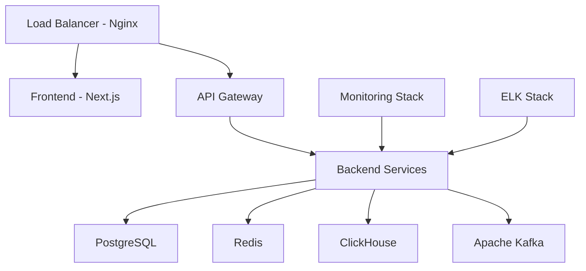

# 🔧 دليل التشغيل والصيانة - سبق الذكية

## 📋 نظرة عامة

هذا الدليل الشامل مخصص لفرق DevOps والتشغيل لإدارة وصيانة نظام "سبق الذكية" في بيئة الإنتاج. يغطي جميع جوانب النشر والمراقبة والصيانة واستكشاف الأخطاء.

---

## 🏗️ البنية التحتية

### 🖥️ مكونات النظام



#### **الخدمات الأساسية**

| الخدمة | التقنية | المنفذ | الوصف |
|---------|---------|---------|---------|
| 🌐 **Frontend** | Next.js 15 | 3000 | واجهة المستخدم |
| 🔗 **API Gateway** | Nginx | 80/443 | توزيع الأحمال |
| 🗄️ **Database** | PostgreSQL 15 | 5432 | قاعدة البيانات الرئيسية |
| ⚡ **Cache** | Redis 7 | 6379 | التخزين المؤقت |
| 📊 **Analytics** | ClickHouse | 8123 | تحليل البيانات |
| 🌊 **Messaging** | Apache Kafka | 9092 | معالجة الأحداث |

#### **خدمات المراقبة**

| الخدمة | المنفذ | الاستخدام |
|---------|---------|---------|
| 📈 **Prometheus** | 9090 | جمع المقاييس |
| 📊 **Grafana** | 3001 | لوحات المراقبة |
| 🔍 **Elasticsearch** | 9200 | فهرسة السجلات |
| 📝 **Kibana** | 5601 | تحليل السجلات |
| 📊 **Redis Commander** | 8081 | إدارة Redis |
| 🗄️ **Adminer** | 8080 | إدارة قواعد البيانات |

---

## 🚀 النشر والإعداد

### 📋 قائمة تحقق ما قبل النشر

#### **1. التحقق من البيئة**
```bash
# فحص الموارد المطلوبة
./scripts/pre-deployment-check.sh

# التحقق من الاتصال بقواعد البيانات
kubectl exec -it postgres-pod -- pg_isready
kubectl exec -it redis-pod -- redis-cli ping

# فحص الشهادات SSL
openssl x509 -in cert.pem -text -noout
```

#### **2. النسخ الاحتياطية**
```bash
# نسخة احتياطية من قاعدة البيانات
kubectl exec postgres-pod -- pg_dump sabq_ai_cms > backup_$(date +%Y%m%d_%H%M%S).sql

# نسخة احتياطية من Redis
kubectl exec redis-pod -- redis-cli BGSAVE

# نسخة احتياطية من ملفات التكوين
tar -czf config_backup_$(date +%Y%m%d_%H%M%S).tar.gz k8s/ config/
```

#### **3. إعدادات الأمان**
```bash
# فحص الثغرات الأمنية
npm audit
npx snyk test

# فحص Docker images
docker scout cves ghcr.io/alialhazmi/sabq-ai-cms:latest

# التحقق من الصلاحيات
kubectl auth can-i --list --as=system:serviceaccount:sabq-ai-cms:sabq-ai-cms-sa
```

### 🚀 إجراءات النشر

#### **نشر بيئة الإنتاج**

```bash
#!/bin/bash
# Production Deployment Script

set -euo pipefail

echo "🚀 بدء نشر الإنتاج..."

# 1. التحقق من البيئة
echo "📋 فحص البيئة..."
./scripts/health-check.sh

# 2. النسخ الاحتياطية
echo "💾 إنشاء نسخ احتياطية..."
./scripts/backup.sh --env=production

# 3. بناء وتحديث الصور
echo "🏗️ بناء الصور..."
docker build -t ghcr.io/alialhazmi/sabq-ai-cms:$(git rev-parse --short HEAD) .
docker push ghcr.io/alialhazmi/sabq-ai-cms:$(git rev-parse --short HEAD)

# 4. تحديث Kubernetes
echo "☸️ تحديث Kubernetes..."
kubectl set image deployment/sabq-ai-cms sabq-ai-cms=ghcr.io/alialhazmi/sabq-ai-cms:$(git rev-parse --short HEAD) -n sabq-ai-cms

# 5. انتظار النشر
echo "⏳ انتظار اكتمال النشر..."
kubectl rollout status deployment/sabq-ai-cms -n sabq-ai-cms --timeout=600s

# 6. فحص صحة النظام
echo "🏥 فحص صحة النظام..."
./scripts/post-deployment-check.sh

echo "✅ تم النشر بنجاح!"
```

#### **استراتيجية Zero-Downtime**

```yaml
# deployment.yaml
apiVersion: apps/v1
kind: Deployment
metadata:
  name: sabq-ai-cms
spec:
  strategy:
    type: RollingUpdate
    rollingUpdate:
      maxSurge: 1
      maxUnavailable: 0
  replicas: 3
  template:
    spec:
      containers:
      - name: sabq-ai-cms
        readinessProbe:
          httpGet:
            path: /api/health
            port: 3000
          initialDelaySeconds: 10
          periodSeconds: 5
        livenessProbe:
          httpGet:
            path: /api/health
            port: 3000
          initialDelaySeconds: 30
          periodSeconds: 10
```

---

## 📊 المراقبة والتنبيهات

### 🎯 المقاييس الأساسية

#### **مقاييس الأداء**

```prometheus
# Response Time (95th percentile)
histogram_quantile(0.95, sum(rate(http_request_duration_seconds_bucket[5m])) by (le))

# Request Rate
sum(rate(http_requests_total[5m]))

# Error Rate
sum(rate(http_requests_total{status=~"5.."}[5m])) / sum(rate(http_requests_total[5m])) * 100

# Database Connections
pg_stat_activity_count
redis_connected_clients

# Memory Usage
container_memory_usage_bytes{pod=~"sabq-ai-cms.*"} / container_spec_memory_limit_bytes{pod=~"sabq-ai-cms.*"} * 100
```

#### **تنبيهات Prometheus**

```yaml
# alerts.yml
groups:
- name: sabq-ai-cms
  rules:
  - alert: HighResponseTime
    expr: histogram_quantile(0.95, sum(rate(http_request_duration_seconds_bucket[5m])) by (le)) > 0.5
    for: 2m
    labels:
      severity: warning
    annotations:
      summary: "وقت الاستجابة مرتفع"
      description: "وقت الاستجابة الـ 95th percentile أكبر من 500ms"

  - alert: HighErrorRate
    expr: sum(rate(http_requests_total{status=~"5.."}[5m])) / sum(rate(http_requests_total[5m])) * 100 > 5
    for: 1m
    labels:
      severity: critical
    annotations:
      summary: "معدل أخطاء مرتفع"
      description: "معدل الأخطاء {{ $value }}% أكبر من 5%"

  - alert: DatabaseDown
    expr: pg_up == 0
    for: 0m
    labels:
      severity: critical
    annotations:
      summary: "قاعدة البيانات غير متاحة"
      description: "PostgreSQL غير متاح"

  - alert: RedisDown
    expr: redis_up == 0
    for: 0m
    labels:
      severity: critical
    annotations:
      summary: "Redis غير متاح"
      description: "خدمة Redis غير متاحة"
```

### 📊 لوحات Grafana

#### **لوحة الأداء الرئيسية**

```json
{
  "dashboard": {
    "title": "سبق الذكية - الأداء الرئيسي",
    "panels": [
      {
        "title": "وقت الاستجابة",
        "type": "graph",
        "targets": [
          {
            "expr": "histogram_quantile(0.95, sum(rate(http_request_duration_seconds_bucket[5m])) by (le))",
            "legendFormat": "95th Percentile"
          }
        ]
      },
      {
        "title": "معدل الطلبات",
        "type": "graph",
        "targets": [
          {
            "expr": "sum(rate(http_requests_total[5m]))",
            "legendFormat": "Requests/sec"
          }
        ]
      },
      {
        "title": "استخدام الذاكرة",
        "type": "graph",
        "targets": [
          {
            "expr": "container_memory_usage_bytes{pod=~\"sabq-ai-cms.*\"} / 1024 / 1024",
            "legendFormat": "Memory (MB)"
          }
        ]
      }
    ]
  }
}
```

---

## 🗄️ إدارة قواعد البيانات

### 📊 PostgreSQL

#### **مراقبة الأداء**

```sql
-- فحص الاستعلامات البطيئة
SELECT query, mean_time, calls, total_time
FROM pg_stat_statements
ORDER BY mean_time DESC
LIMIT 10;

-- فحص حجم الجداول
SELECT 
    schemaname,
    tablename,
    pg_size_pretty(pg_total_relation_size(schemaname||'.'||tablename)) as size
FROM pg_tables
WHERE schemaname = 'public'
ORDER BY pg_total_relation_size(schemaname||'.'||tablename) DESC;

-- فحص الاتصالات النشطة
SELECT count(*) as connections,
       state,
       application_name
FROM pg_stat_activity
GROUP BY state, application_name;
```

#### **صيانة دورية**

```bash
#!/bin/bash
# PostgreSQL Maintenance Script

# تنظيف وإعادة فهرسة
kubectl exec postgres-pod -- psql -d sabq_ai_cms -c "VACUUM ANALYZE;"
kubectl exec postgres-pod -- psql -d sabq_ai_cms -c "REINDEX DATABASE sabq_ai_cms;"

# إحصائيات قاعدة البيانات
kubectl exec postgres-pod -- psql -d sabq_ai_cms -c "SELECT * FROM pg_stat_database WHERE datname = 'sabq_ai_cms';"

# فحص سجل الأخطاء
kubectl logs postgres-pod | grep ERROR | tail -20
```

### ⚡ Redis

#### **مراقبة Redis**

```bash
# معلومات عامة
kubectl exec redis-pod -- redis-cli INFO

# مراقبة استخدام الذاكرة
kubectl exec redis-pod -- redis-cli INFO memory

# إحصائيات الاتصالات
kubectl exec redis-pod -- redis-cli INFO clients

# مراقبة أداء الأوامر
kubectl exec redis-pod -- redis-cli INFO commandstats
```

#### **صيانة Redis**

```bash
#!/bin/bash
# Redis Maintenance Script

# نسخة احتياطية
kubectl exec redis-pod -- redis-cli BGSAVE

# تنظيف الذاكرة
kubectl exec redis-pod -- redis-cli MEMORY PURGE

# فحص حالة التكرار (إذا كان متاحاً)
kubectl exec redis-pod -- redis-cli INFO replication

# إحصائيات المفاتيح
kubectl exec redis-pod -- redis-cli --scan --pattern "*" | wc -l
```

---

## 🔍 السجلات والمراقبة

### 📝 إدارة السجلات

#### **تكوين Logrotate**

```bash
# /etc/logrotate.d/sabq-ai-cms
/var/log/sabq-ai-cms/*.log {
    daily
    missingok
    rotate 7
    compress
    delaycompress
    notifempty
    sharedscripts
    postrotate
        systemctl reload rsyslog
    endscript
}
```

#### **مراقبة السجلات المباشرة**

```bash
# سجلات التطبيق
kubectl logs -f deployment/sabq-ai-cms -n sabq-ai-cms

# سجلات قاعدة البيانات
kubectl logs -f deployment/postgres -n sabq-ai-cms

# سجلات Nginx
kubectl logs -f deployment/nginx -n sabq-ai-cms

# البحث في السجلات
kubectl logs deployment/sabq-ai-cms -n sabq-ai-cms | grep ERROR | tail -20
```

### 🔍 Elasticsearch وKibana

#### **استعلامات مفيدة**

```json
// البحث عن الأخطاء الأخيرة
{
  "query": {
    "bool": {
      "must": [
        {"match": {"level": "ERROR"}},
        {"range": {"@timestamp": {"gte": "now-1h"}}}
      ]
    }
  },
  "sort": [{"@timestamp": {"order": "desc"}}]
}

// تجميع الأخطاء حسب النوع
{
  "aggs": {
    "error_types": {
      "terms": {"field": "error.type.keyword"}
    }
  }
}
```

#### **إعداد التنبيهات في Kibana**

```json
{
  "trigger": {
    "schedule": {"interval": "1m"}
  },
  "input": {
    "search": {
      "request": {
        "search_type": "query_then_fetch",
        "indices": ["logs-*"],
        "body": {
          "query": {
            "bool": {
              "must": [
                {"match": {"level": "ERROR"}},
                {"range": {"@timestamp": {"gte": "now-5m"}}}
              ]
            }
          }
        }
      }
    }
  },
  "condition": {
    "compare": {"ctx.payload.hits.total": {"gt": 10}}
  }
}
```

---

## 🛡️ الأمان والنسخ الاحتياطية

### 🔒 إجراءات الأمان

#### **فحص أمني دوري**

```bash
#!/bin/bash
# Security Audit Script

echo "🔍 بدء الفحص الأمني..."

# فحص الثغرات في التبعيات
npm audit --audit-level moderate

# فحص Snyk
npx snyk test --severity-threshold=high

# فحص Docker images
docker scout cves ghcr.io/alialhazmi/sabq-ai-cms:latest

# فحص SSL certificates
echo | openssl s_client -servername sabq-ai.com -connect sabq-ai.com:443 2>/dev/null | openssl x509 -noout -dates

# فحص صلاحيات Kubernetes
kubectl auth can-i --list --as=system:serviceaccount:sabq-ai-cms:sabq-ai-cms-sa

echo "✅ انتهى الفحص الأمني"
```

#### **تحديث الأمان**

```bash
# تحديث التبعيات
npm update
npm audit fix

# تحديث Docker base image
docker pull node:18-alpine
docker build -t sabq-ai-cms:latest .

# تحديث Kubernetes
kubectl apply -f k8s/security-updates/
```

### 💾 النسخ الاحتياطية

#### **نسخ احتياطية شاملة**

```bash
#!/bin/bash
# Comprehensive Backup Script

BACKUP_DIR="/backups/$(date +%Y%m%d_%H%M%S)"
mkdir -p "$BACKUP_DIR"

echo "📦 بدء النسخ الاحتياطي الشامل..."

# 1. قاعدة البيانات
echo "🗄️ نسخة احتياطية من PostgreSQL..."
kubectl exec postgres-pod -- pg_dump sabq_ai_cms | gzip > "$BACKUP_DIR/postgres.sql.gz"

# 2. Redis
echo "⚡ نسخة احتياطية من Redis..."
kubectl exec redis-pod -- redis-cli --rdb /tmp/dump.rdb
kubectl cp redis-pod:/tmp/dump.rdb "$BACKUP_DIR/redis.rdb"

# 3. ClickHouse
echo "📊 نسخة احتياطية من ClickHouse..."
kubectl exec clickhouse-pod -- clickhouse-client --query="BACKUP DATABASE sabq_analytics TO S3('s3://backups/clickhouse/$(date +%Y%m%d_%H%M%S)')"

# 4. ملفات التكوين
echo "⚙️ نسخة احتياطية من التكوين..."
tar -czf "$BACKUP_DIR/config.tar.gz" k8s/ config/ scripts/

# 5. الملفات المرفوعة
echo "📁 نسخة احتياطية من الملفات..."
kubectl exec sabq-ai-cms-pod -- tar -czf /tmp/uploads.tar.gz /app/uploads/
kubectl cp sabq-ai-cms-pod:/tmp/uploads.tar.gz "$BACKUP_DIR/uploads.tar.gz"

# 6. رفع للسحابة
echo "☁️ رفع للسحابة..."
aws s3 sync "$BACKUP_DIR" "s3://sabq-ai-backups/$(date +%Y%m%d_%H%M%S)/"

# 7. تنظيف النسخ القديمة (أكثر من 30 يوم)
find /backups -type d -mtime +30 -exec rm -rf {} \;

echo "✅ انتهى النسخ الاحتياطي"
```

#### **استرداد من النسخ الاحتياطية**

```bash
#!/bin/bash
# Recovery Script

BACKUP_DATE="$1"
BACKUP_DIR="/backups/$BACKUP_DATE"

if [ ! -d "$BACKUP_DIR" ]; then
    echo "❌ النسخة الاحتياطية غير موجودة: $BACKUP_DATE"
    exit 1
fi

echo "🔄 بدء الاسترداد من: $BACKUP_DATE"

# 1. إيقاف التطبيق
echo "⏸️ إيقاف التطبيق..."
kubectl scale deployment sabq-ai-cms --replicas=0 -n sabq-ai-cms

# 2. استرداد قاعدة البيانات
echo "🗄️ استرداد PostgreSQL..."
gunzip -c "$BACKUP_DIR/postgres.sql.gz" | kubectl exec -i postgres-pod -- psql sabq_ai_cms

# 3. استرداد Redis
echo "⚡ استرداد Redis..."
kubectl exec redis-pod -- redis-cli FLUSHALL
kubectl cp "$BACKUP_DIR/redis.rdb" redis-pod:/data/dump.rdb
kubectl exec redis-pod -- redis-cli DEBUG RESTART

# 4. استرداد الملفات
echo "📁 استرداد الملفات..."
kubectl cp "$BACKUP_DIR/uploads.tar.gz" sabq-ai-cms-pod:/tmp/
kubectl exec sabq-ai-cms-pod -- tar -xzf /tmp/uploads.tar.gz -C /

# 5. إعادة تشغيل التطبيق
echo "▶️ إعادة تشغيل التطبيق..."
kubectl scale deployment sabq-ai-cms --replicas=3 -n sabq-ai-cms

echo "✅ انتهى الاسترداد"
```

---

## ⚡ تحسين الأداء

### 🚀 تحسين الخادم

#### **تحسين Nginx**

```nginx
# nginx.conf optimizations
worker_processes auto;
worker_connections 4096;
worker_rlimit_nofile 65535;

http {
    # Performance
    sendfile on;
    tcp_nopush on;
    tcp_nodelay on;
    keepalive_timeout 65;
    keepalive_requests 100000;
    
    # Caching
    proxy_cache_path /var/cache/nginx levels=1:2 keys_zone=cache:10m max_size=10g inactive=60m;
    
    # Compression
    gzip on;
    gzip_vary on;
    gzip_min_length 1024;
    gzip_types text/plain text/css application/json application/javascript;
    
    # Rate limiting
    limit_req_zone $binary_remote_addr zone=api:10m rate=10r/s;
    
    upstream backend {
        least_conn;
        server sabq-ai-cms-1:3000 weight=3;
        server sabq-ai-cms-2:3000 weight=3;
        server sabq-ai-cms-3:3000 weight=3;
        keepalive 32;
    }
}
```

#### **تحسين قاعدة البيانات**

```sql
-- PostgreSQL Performance Tuning

-- تحسين الذاكرة
ALTER SYSTEM SET shared_buffers = '256MB';
ALTER SYSTEM SET effective_cache_size = '1GB';
ALTER SYSTEM SET work_mem = '4MB';
ALTER SYSTEM SET maintenance_work_mem = '64MB';

-- تحسين الكتابة
ALTER SYSTEM SET wal_buffers = '16MB';
ALTER SYSTEM SET checkpoint_completion_target = 0.9;
ALTER SYSTEM SET checkpoint_timeout = '10min';

-- تحسين الاستعلامات
ALTER SYSTEM SET random_page_cost = 1.1;
ALTER SYSTEM SET seq_page_cost = 1.0;

-- إعادة تحميل التكوين
SELECT pg_reload_conf();
```

### 📊 مراقبة الأداء

#### **مقاييس مهمة للمراقبة**

```bash
# CPU Usage
kubectl top nodes
kubectl top pods -n sabq-ai-cms

# Memory Usage
kubectl describe node | grep -A 5 "Allocated resources"

# Disk I/O
kubectl exec postgres-pod -- iostat -x 1 5

# Network
kubectl exec sabq-ai-cms-pod -- netstat -i
```

#### **تحسين Kubernetes**

```yaml
# HPA Configuration
apiVersion: autoscaling/v2
kind: HorizontalPodAutoscaler
metadata:
  name: sabq-ai-cms-hpa
spec:
  scaleTargetRef:
    apiVersion: apps/v1
    kind: Deployment
    name: sabq-ai-cms
  minReplicas: 3
  maxReplicas: 20
  metrics:
  - type: Resource
    resource:
      name: cpu
      target:
        type: Utilization
        averageUtilization: 70
  - type: Resource
    resource:
      name: memory
      target:
        type: Utilization
        averageUtilization: 80
  behavior:
    scaleUp:
      stabilizationWindowSeconds: 60
      policies:
      - type: Percent
        value: 100
        periodSeconds: 60
    scaleDown:
      stabilizationWindowSeconds: 300
      policies:
      - type: Percent
        value: 10
        periodSeconds: 60
```

---

## 🆘 استكشاف الأخطاء

### 🔍 مشاكل شائعة وحلولها

#### **مشكلة: التطبيق لا يستجيب**

```bash
# 1. فحص صحة الخدمة
kubectl get pods -n sabq-ai-cms
kubectl describe pod sabq-ai-cms-pod -n sabq-ai-cms

# 2. فحص السجلات
kubectl logs sabq-ai-cms-pod -n sabq-ai-cms --tail=100

# 3. فحص الموارد
kubectl top pod sabq-ai-cms-pod -n sabq-ai-cms

# 4. فحص الشبكة
kubectl exec sabq-ai-cms-pod -- netstat -tulpn

# 5. إعادة تشغيل إذا لزم الأمر
kubectl rollout restart deployment/sabq-ai-cms -n sabq-ai-cms
```

#### **مشكلة: قاعدة البيانات بطيئة**

```sql
-- فحص الاستعلامات البطيئة
SELECT query, mean_time, calls, total_time
FROM pg_stat_statements
WHERE mean_time > 1000  -- أكثر من ثانية
ORDER BY mean_time DESC;

-- فحص الفهارس المفقودة
SELECT schemaname, tablename, attname, n_distinct, correlation
FROM pg_stats
WHERE schemaname = 'public'
  AND n_distinct > 100
  AND correlation < 0.1;

-- فحص الاتصالات
SELECT count(*), state FROM pg_stat_activity GROUP BY state;
```

#### **مشكلة: استخدام ذاكرة مرتفع**

```bash
# فحص استخدام الذاكرة
kubectl exec sabq-ai-cms-pod -- ps aux --sort=-%mem | head -10

# فحص تسريب الذاكرة
kubectl exec sabq-ai-cms-pod -- node --inspect=0.0.0.0:9229 app.js

# تحليل Heap
kubectl exec sabq-ai-cms-pod -- kill -USR2 $(pidof node)
```

### 📞 جهات الاتصال للطوارئ

| المستوى | النوع | التواصل | وقت الاستجابة |
|---------|-------|---------|---------|
| 🔴 **Critical** | فشل النظام | +966501234567 | فوري |
| 🟡 **High** | أداء ضعيف | devops@sabq-ai.com | 15 دقيقة |
| 🟢 **Medium** | مشاكل عامة | support@sabq-ai.com | ساعة واحدة |

### 📋 قائمة تحقق الطوارئ

#### **عند فشل النظام**

1. ✅ **فحص الحالة العامة**
   ```bash
   kubectl get pods --all-namespaces
   kubectl get nodes
   kubectl get services -n sabq-ai-cms
   ```

2. ✅ **فحص قواعد البيانات**
   ```bash
   kubectl exec postgres-pod -- pg_isready
   kubectl exec redis-pod -- redis-cli ping
   ```

3. ✅ **فحص الشبكة**
   ```bash
   kubectl get ingress -n sabq-ai-cms
   kubectl describe service sabq-ai-cms-service -n sabq-ai-cms
   ```

4. ✅ **تفعيل وضع الصيانة**
   ```bash
   kubectl patch deployment sabq-ai-cms -p '{"spec":{"replicas":0}}' -n sabq-ai-cms
   kubectl apply -f maintenance-page.yaml
   ```

5. ✅ **إشعار الفريق**
   ```bash
   curl -X POST https://hooks.slack.com/... -d '{"text":"🚨 نظام سبق الذكية متوقف"}'
   ```

---

## 🔄 صيانة دورية

### 📅 مهام يومية

```bash
#!/bin/bash
# Daily Maintenance Tasks

# فحص صحة النظام
./scripts/health-check.sh

# تنظيف السجلات القديمة
find /var/log -name "*.log" -mtime +7 -delete

# فحص استخدام القرص
df -h | awk '$5 > "80%" {print $0}' | mail -s "Disk Usage Alert" admin@sabq-ai.com

# نسخة احتياطية تزايدية
./scripts/incremental-backup.sh
```

### 📅 مهام أسبوعية

```bash
#!/bin/bash
# Weekly Maintenance Tasks

# تحديث الحزم الأمنية
apt update && apt upgrade -y

# تنظيف Docker
docker system prune -f

# تحليل قاعدة البيانات
kubectl exec postgres-pod -- psql -d sabq_ai_cms -c "ANALYZE;"

# تقرير الأداء الأسبوعي
./scripts/weekly-performance-report.sh
```

### 📅 مهام شهرية

```bash
#!/bin/bash
# Monthly Maintenance Tasks

# فحص شامل للأمان
./scripts/security-audit.sh

# تحديث التبعيات
npm update
npm audit fix

# تنظيف النسخ الاحتياطية القديمة
find /backups -type f -mtime +30 -delete

# مراجعة السعة والتخطيط
./scripts/capacity-planning.sh
```

---

## 📋 التوثيق والتقارير

### 📊 تقارير دورية

#### **تقرير الأداء اليومي**

```bash
#!/bin/bash
# Daily Performance Report

REPORT_DATE=$(date +%Y-%m-%d)
REPORT_FILE="reports/performance-$REPORT_DATE.html"

echo "<h1>تقرير الأداء - $REPORT_DATE</h1>" > $REPORT_FILE

# Response Time
echo "<h2>وقت الاستجابة</h2>" >> $REPORT_FILE
curl -s "http://prometheus:9090/api/v1/query?query=histogram_quantile(0.95,sum(rate(http_request_duration_seconds_bucket[24h])))" | jq '.data.result[0].value[1]' >> $REPORT_FILE

# Error Rate
echo "<h2>معدل الأخطاء</h2>" >> $REPORT_FILE
curl -s "http://prometheus:9090/api/v1/query?query=sum(rate(http_requests_total{status=~'5..'}[24h]))/sum(rate(http_requests_total[24h]))*100" | jq '.data.result[0].value[1]' >> $REPORT_FILE

# إرسال التقرير
mail -a "Content-Type: text/html" -s "تقرير الأداء اليومي - $REPORT_DATE" admin@sabq-ai.com < $REPORT_FILE
```

#### **تقرير الحوادث**

```markdown
# تقرير الحادث

**التاريخ:** 2024-12-16
**الوقت:** 14:30 UTC
**المدة:** 15 دقيقة
**التأثير:** انقطاع جزئي في الخدمة

## الوصف
انقطاع في خدمة قاعدة البيانات بسبب استنفاد اتصالات PostgreSQL.

## الجذر السبب
تسريب في connection pool بسبب عدم إغلاق الاتصالات بشكل صحيح.

## الحل
- إعادة تشغيل خدمة قاعدة البيانات
- زيادة عدد الاتصالات المسموحة
- إصلاح كود التطبيق

## الإجراءات الوقائية
- إضافة مراقبة لاتصالات قاعدة البيانات
- تحسين connection pool configuration
- إضافة اختبارات لتسريب الاتصالات
```

### 📚 توثيق العمليات

#### **كتيب الإجراءات (Runbook)**

```markdown
# إجراءات التشغيل - سبق الذكية

## 1. بدء الخدمة
```bash
kubectl apply -f k8s/
kubectl rollout status deployment/sabq-ai-cms -n sabq-ai-cms
```

## 2. إيقاف الخدمة
```bash
kubectl scale deployment sabq-ai-cms --replicas=0 -n sabq-ai-cms
```

## 3. إعادة التشغيل
```bash
kubectl rollout restart deployment/sabq-ai-cms -n sabq-ai-cms
```

## 4. التحقق من الصحة
```bash
curl -f http://sabq-ai.com/api/health
```
```

---

## 🎓 التدريب ونقل المعرفة

### 📖 دليل التدريب للفريق الجديد

#### **اليوم الأول: البنية العامة**
1. مراجعة البنية التقنية
2. فهم مكونات النظام
3. إعداد البيئة المحلية
4. تشغيل النظام محلياً

#### **اليوم الثاني: المراقبة**
1. استخدام Grafana
2. قراءة سجلات Kibana
3. فهم تنبيهات Prometheus
4. تحليل مقاييس الأداء

#### **اليوم الثالث: النشر**
1. فهم CI/CD pipeline
2. تطبيق نشر تجريبي
3. إجراءات الاسترداد
4. اختبار النسخ الاحتياطية

#### **اليوم الرابع: استكشاف الأخطاء**
1. حل مشاكل شائعة
2. استخدام أدوات التشخيص
3. التعامل مع الحوادث
4. كتابة تقارير الحوادث

#### **اليوم الخامس: التقييم**
1. امتحان عملي
2. محاكاة حادث
3. مراجعة الأداء
4. شهادة إتمام التدريب

---

**تم إعداد هذا الدليل بواسطة فريق DevOps - سبق الذكية**  
*آخر تحديث: ديسمبر 2024*

---

[🔙 العودة للدليل الرئيسي](../README.md) | [📚 المزيد من التوثيق](../docs/)
